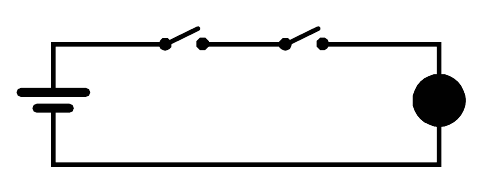
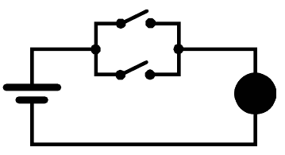
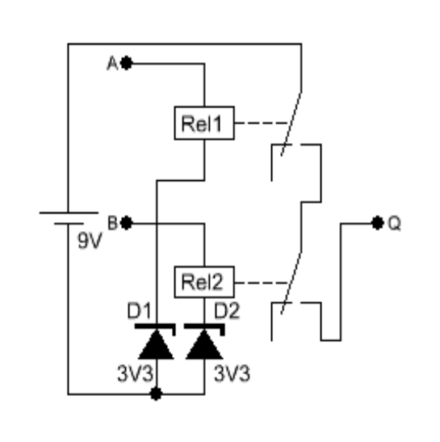

<!--

author:   Sebastian Zug & André Dietrich & Fabian Bär
email:    sebastian.zug@informatik.tu-freiberg.de & andre.dietrich@informatik.tu-freiberg.de & fabian.baer@student.tu-freiberg.de
version:  0.0.1
language: de
narrator: Deutsch Female

import: https://raw.githubusercontent.com/LiaTemplates/NetSwarm-Simulator/master/README.md

-->

# 02 - Boolsche Algebra

**TU Bergakademie Freiberg - Wintersemester 2020 / 21**

Link auf die aktuelle Vorlesung im Versionsmanagementsystem GitHub

[https://github.com/TUBAF-IfI-LiaScript/VL_EingebetteteSysteme/blob/master/02_BoolscheAlgebra.md](https://github.com/TUBAF-IfI-LiaScript/VL_EingebetteteSysteme/blob/master/02_BoolscheAlgebra.md)

Die interaktive Form ist unter diesem  zu finden [Link](https://liascript.github.io/course/?https://raw.githubusercontent.com/TUBAF-IfI-LiaScript/VL_EingebetteteSysteme/master/02_BoolscheAlgebra.md#1).


> Hinweis auf Studienverlaufsplan

https://tu-freiberg.de/studium/diplom-robotik

---------------------------------------------------------------------

** Fragen an die Veranstaltung**

+ Nennen Sie die Axiome der Boolschen Algebra.
+ Erläutern Sie das Dualitätsprinzip der Boolschen Algebra.
+ Wie viele Schaltfunktionen existieren für 2 Eingangsvariablen?
+ Nennen Sie 3 Beispiele, wie eine Schaltfunktion technisch umgesetzt werden kann.
+ Welcher Unterschied besteht zwischen der DNF und der KDNF?
+ Welcher Unterschied besteht zwischen der DNF und der KNF?
+ Geben Sie das de Morgansche Gesetz wieder.

<!--
style="width: 80%; min-width: 420px; max-width: 720px;"
-->
```ascii

                Abstraktionsebenen

           +----------------------------+ -.
  Ebene 6  | Problemorientierte Sprache |  |
           +----------------------------+  |
                                           ⎬ Anwendungssoftware
           +----------------------------+  |
  Ebene 5  | Assemblersprache           |  |
           +----------------------------+ -.

           +----------------------------+
  Ebene 4  | Betriebssystem             |     Systemsoftware
           +----------------------------+

           +----------------------------+
  Ebene 3  | Istruktionsset             |     Maschinensprache
           +----------------------------+

           +----------------------------+  -.
  Ebene 2  | Mikroarchitektur           |   |
           +----------------------------+   |
                                            ⎬ Automaten, Speicher, Logik
           +----------------------------+   |       ╔═══════════════╗
  Ebene 1  | Digitale Logik             |   |    ◀══║ HIER SIND WIR!║
           +----------------------------+  -.       ╚═══════════════╝

           +----------------------------+
  Ebene 0  | E-Technik, Physik          |     Analoge Phänomene
           +----------------------------+                                      .
```

---------------------------------------------------------------------

## Digital vs. Analog

Was bedeutet der Übergang von der Ebene der physikalischen Phänomene (0) auf die
Ebene der digitalen Logik (2)?

Ein Digitalsignal ist ein Signal, welches durch diskrete Werte repräsentiert
wird und seine zeitliche Entwicklung beschreibt. Es kann aus einem Analogsignal
heraus abgeleitet werden, dass einen zeitlich-kontinuierlichen Verlauf einer
physikalischen Größe repräsentiert:

+ Temperatur im Tagesverlauf
+ Spannungswert am IC innerhalb der letzten $n$ Nanosekunden
+ ...

Die Umwandlung eines Analogsignals in ein Digitalsignal geschieht durch
Quantisierung und Abtastung, welche zu definierten Zeitpunkten erfolgt. Digitale
Werte sind üblicherweise als Binärzahlen kodiert. Ihre Quantisierung wird somit
in Bits angegeben.

<e-charts
option='{
  "xAxis": {
    "type": "category",
    "data": ["00", "01","02","03","04","05"],
    "name": "Zeitschritt"
  },
  "yAxis": [{
    "type": "value",
    "name": "Wert"
  }],
  "series": [
  {
    "data": [820, 932,601,1234,1290,1430],
    "type":"line",
    "smooth": "true"
  },
  {
  "data": [820, 932,601,1234,1290,1430],
    "type":"line",
    "step": "end",
    "lineStyle": {
              "color": "green",
              "width": "2",
              "type": "dashed"
                 },
    "itemStyle": {
                     "borderWidth": "3",
                     "borderColor": "yellow",
                     "color": "blue"
                 }
  }]
}'></e-charts>


<div id="functionPlot"></div>

Die Abtastung und Bildung des Digitalsignals erfolgt üblicherweise in konstanten Zeitintervallen, allerdings ist dies nicht zwingend notwendig.


### Kontrastprogramm - Analoge Rechner

<!-- width="50%" --> [^1]

[^1]: Wuselig, Deutsch: Analogrechner MEDA 42TA Aritma Prag, Tschechoslowakei, um 1970, https://commons.wikimedia.org/wiki/File:Analogrechner_MEDA_42TA-DSC4445.jpg

[Link](http://www.analogmuseum.org/deutsch/collection/meda/43/)

Die Eingabe erfolgte durch verbinden der Komponenten des  mittels Programmierschnüren, Steckern und Rechenimpedanzen (Widerstände für die Summatoren und Integratoren) auf der Programmiertafel.

> Wem jetzt gleich die Parallelität zu der Stecker-basierten Programmierung des ENIAC einfällt ... Vorsicht dieser war ein Digitalrechner!

Zur Auswertung stand zurVerfügung:

+ 6-Strahl-Oszilloskop OPD 280 U
+ X-Y-Schreiber BAK 5 T
+ Digitalvoltmeter

|           | Analoge Hardware                                 | Digitale Hardware                        |
| --------- | ------------------------------------------------ | ---------------------------------------- |
| Vorteile  | Multiplikation und Addition einfach realisierbar | unempfindlich gegen Störungen (Rauschen) |
|           | vergleichsweise schnell                          | einfacher Entwurf                        |
|           |                                                  | beliebig hohe Präzision möglich          |
| Nachteile | Temperaturabhängigkeit                           | vergleichsweise hoher Energieverbrauch   |
|           | nichtlineare Bauteile                            |                                          |
|           | Präzision nur bei ca. 6 - 8 Bit                  |                                          |
|           | Langzeitspeicherung von Daten schwierig          |                                          |

> Digitaltechnik ermöglicht eine einfache Realisierung robuster Hardware

### Pegel

> Digitalisierung: Aufteilung des kontinuierlichen Spektrums in erlaubte und verbotene Bereiche

Verschiedene Standards definieren unterschiedliche Spannungspotentiale für einen High- und einen Low-Pegel. Dazwischen

<!--
style="width: 80%; min-width: 420px; max-width: 720px;"
-->
```ascii
         ^
Spannung |   |5.0|    |   |              TTL Logikgatter
         |   |   |    |   |
         |   |   |    |   |
         |   |   |    |2.4|
         |   |2.0|    +---+
         |   +---+
         |
         |   Verbotener Bereich
         |
         |   +---+
         |   |0.8|    +---+
         |   |   |    |0.4|
         +------------------------>
            Eingang  Ausgang                                        .
```

> **Frage:** Warum ist der undefinierte Bereich des Einganges schmaler als der des Ausganges?

## Motivation

Nehmen wir folgende einfache Schaltung an:

<!-- width="60%" -->

Wir betrachten den Schalter mit seinen 2 Zuständen als Input und die Glühlampe als Output. Das Übergangsverhalten wird ignoiert.

| Input                | Output               |
| -------------------- | -------------------- |
| Schalter geschlossen | Lampe leuchtet       |
| Schalter offen       | Lampe leuchtet nicht |

Für zwei Schalter (Inputs) lassen sich darauf aufbauen zwei grundlegende Schaltungsmuster entwerfen:

| Reihenschaltung | Parallelschaltung |
| --------------- | ----------------- |
|  <!-- width="80%" -->            |  <!-- width="80%" -->                    |
| Die Lampe leuchtet, wenn der erste und der zweite Schalter geschlossen werden               | Lampe leuchtet, wenn der erste oder der zweite Schalter geschlossen wird            |

                      {{1}}
****************************************************************

 <!-- width="80%" -->

> Es gibt verschiedene Lösungen, um die Lampe mit drei geschlossenen Schaltern zum Leuchten zu bringen. Wie viele? Wieviele Kombinationen von Schalterbelegungen sind möglich?

> Wir brauchen eine Abstraktion, um die Abbidlung von digitalen Eingängen E auf einen digitalen Ausgang A repräsentieren und analysieren zu können.

Dazu beschreiben wir die Wirkung des elektrischen Stromes

+ Stromfluss / kein (oder ein sehr geringer) Stromfluss
+ Spannung / keine (oder eine sehr geringe) Spannung

... aus Sicht der Logik anhand von Zuständen

+ an / aus
+ wahr / falsch
+ 1 / 0
+ 0 / 1

> Wie aber können logische Grundverknüpfungen identifiziert werden? Auf welchem Wege lassen diese sich praktisch realsieren?

****************************************************************

## Boolsche Algebra

Historische Entwicklung:

+ Aristoteles 384-322 v.Chr.  begründet „Syllogistik“ Lehre von den logischen Schlussformen
+ Später bilden die Stoiker die Syllogistik als Aussagenlogik weiter aus. Im Mittelalter → Scholastik
+ George Boole (1815-1864) 1854 mathematische Formalisierung in „An Investigation of the Laws of Thought on which are founded the Mathematical Theories of Logic and Probabilities".
+ Claude Shannon (1916-2001) hat im Rahmen seiner Masterarbeit: „On the Symbolic Analysis of Relay and Switching Circuits (1940)“, gezeigt, dass man die Boolsche Algebra zur Beschreibung von Schaltkreisen anwenden kann.

<!-- width="40%" --> [^2]

[^2]: Jacobs, Konrad, Shannon, Claude, https://commons.wikimedia.org/wiki/File:ClaudeShannon_MFO3807.jpg

> Problem: Gibt es ein Verfahren,
>
> + um die Äquivalenz zweier Schaltungen formal nachzuweisen ?
>
> + um Schaltungen auf einfache Weise zu transformieren ?
>
> + um minimale Schaltungen zu entwerfen ?

__Lösung:__ Boolesche Algebra basierend auf den Vorarbeiten von G. Boole aus dem Jahre 1854

+ zwei Werte: 0 und 1
+ drei Boolesche Operationen: + , $\cdot$ sowie „not"
+ vier Axiome

Die Boolsche Algebra basiert nach Huntington auf einer Trägermenge
$B \{0,1\}$ (Zuständen) mit zwei Verknüpfungen auf $B$ für deren Element $a\in B$, $b\in B$ und $c\in B$ gilt:

| Axiom                             | Definition |
| --------------------------------- | ---------- |
| Kommuntativität                   | $\begin{aligned} a + b &= b + a \\ a \cdot b &= b \cdot a\end{aligned}$            |
| Distributivität                   | $\begin{aligned} a \cdot (b + c) &= (a \cdot b) + (a \cdot c) \\ a + (b \cdot c) &= (a + b) \cdot (a+c)) \end{aligned}$            |
| Existenz eines neutralen Elements | $\begin{aligned}  0 + a &= a \\ 1\cdot a &= a\end{aligned}$           |
| Exisitenz von Komplementen        |  $\begin{aligned}  a + \overline{a} &= 1 \\ a \cdot \overline{a} &= 0   \end{aligned}$      |

Aus dieser Definition lassen sich die zugehörigen Gesetze der boolschen Algebra ableiten:

| Gesetz               | Definition                                                                                                                                 |
| -------------------- | ------------------------------------------------------------------------------------------------------------------------------------------ |
| Assoziativität       | $\begin{aligned} a + (b + c) &= (a + b) + a = a + b + c \\ a \cdot (b \cdot c) &= (a \cdot b) \cdot a = a \cdot b \cdot c\end{aligned}$    |
| Idempotenzgesetze    | $\begin{aligned} a + a &= a \\ a \cdot a &= a\end{aligned}$                                                                                |
| Absorptionsgesetz    | $\begin{aligned} a + (a \cdot b) &= a \\ a \cdot (a + b) &= a\end{aligned}$                                                                |
| Doppelnegation       | $\begin{aligned} a = \overline{\overline{a}}\end{aligned}$                                                                                 |
| De Morgan'sche Regel | $\begin{aligned} \overline{a + b} &= \overline{a} \cdot \overline{b} \\ \overline{a \cdot b} &= \overline{a} + \overline{b} \end{aligned}$ |
|

> Dualitätsprinzip der Boolschen Algebra ... Ersetzt man gleichzeitig in einem Axiom UND durch ODER und ODER durch UND sowie 1 durch 0 und 0 durch 1, so erhält man das zu diesem Axiom gehörige duale Axiom. Führt man diese Ersetzung in einem Theorem aus, so erhält man das zu diesem Theorem gehörige duale Theorem.

| Form 1                 | Form 2                     |
| ---------------------- | -------------------------- |
| $0 + a = a$            | $1 \cdot a = a$            |
| $1 + a = 1$            | $ 0 \cdot a = 0        $   |
| $a + a = a$            | $ a \cdot a = a         $  |
| $a + \overline{a} = 1$ | $a \cdot \overline{a} = 0$ |

Am Beispiel des Distributivgesetzes

$$
\begin{aligned}
a \cdot (b+c) &= (a \cdot b)+(a \cdot c) \\
a+(b \cdot c) &= (a+b) \cdot (a+c)
\end{aligned}
$$

## Anwendung

Regeln zur Umformung Boolscher Gleichungen

+ Unabhängige Auswertung: Jeder Ausdruck auf der linken oder rechten Seite einer Gleichung kann durch einen anderen ersetzt werden, der mit ihm identisch ist, d.h. man kann die Ausdrücke links und rechtes unabhängig voneinander vereinfachen.

+ Komplementbildung: Die rechte und die linke Seite einer Gleichung können gleichzeitig durch ihre Komplemente ersetzt werden.

+ Erweiterung: Jede Seite einer Gleichung kann mit demselben Ausdruck oder mit einem äquivalenten Ausdruck durch den UND-Operator verknüpft werden. Dual dazu gilt, dass zu jeder Seite äquivalente Ausdrücke durch den ODER-Operator verknüpft werden können.

**Anwendungsbeispiel 1**

$$
\begin{aligned}
f(x_1, x_2, x_3) &= x_1 \cdot x_2 \cdot \overline{x_3} + x_1 \cdot x_2 \cdot x_3 + x_1 \cdot \overline{x_2} \cdot x_3 \\
&= x_1 \cdot x_2 \cdot \overline{x_3} +\textcolor{red}{x_1 \cdot x_2 \cdot x_3}  + x_1 \cdot x_2 \cdot x_3 + x_1 \cdot \overline{x_2} \cdot x_3 & (Idempotenzgesetz) \\
&= \textcolor{red}{x_1 \cdot x_2 \cdot ( \overline{x_3} + x_3)}  + x_1 \cdot x_2 \cdot x_3 + x_1 \cdot \overline{x_2} \cdot x_3 & (Distributivgesetz) \\
&= x_1 \cdot x_2 \cdot ( \overline{x_3} + x_3)  + \textcolor{red}{x_1 \cdot x_3 \cdot x_2  + x_1  \cdot x_3 \cdot \overline{x_2}} & (Kommuativgesetz) \\
&= x_1 \cdot x_2 \cdot ( \overline{x_3} + x_3)  + \textcolor{red}{x_1 \cdot x_3 \cdot (x_2  + \overline{x_2})} & (Distributivgesetz) \\
&= x_1 \cdot x_2 \cdot \textcolor{red}{(1)}  + x_1 \cdot x_3 \cdot \textcolor{red}{(1)}  & (Komplementäres Element) \\
&= x_1 \cdot x_2 \cdot \textcolor{red}{(1)}  + x_1 \cdot x_3 \cdot \textcolor{red}{(1)} & (Neutrales Element) \\
\end{aligned}
$$

{{1}}
**Anwendungsbeispiel 2**

{{1}}
$$
\begin{aligned}
f(x_1, x_2, x_3) &=\overline{w}x\overline{y}\,\overline{z}+\overline{w}x\overline{y}z+w\overline{x}y\overline{z}+wx\overline{y}\,\overline{z}+wx\overline{y}z \\
\end{aligned}
$$

{{2}}
$$
\begin{aligned}
f(w,x,y,z) &=\overline{w}x\overline{y}\,\overline{z}+\overline{w}x\overline{y}z+w\overline{x}y\overline{z}+wx\overline{y}\,\overline{z}+wx\overline{y}z \\
&  =\overline{w}x\overline{y}\left(\overline{z}+z\right)+wx\overline{y}\left(\overline{z}+z\right)+w\overline{x}y\overline{z} & {Kommut., 2xDistr.}\\
 & =\overline{w}x\overline{y}1+wx\overline{y}1+w\overline{x}y\overline{z} & {Komplement.}\\
 & =\overline{w}x\overline{y}+wx\overline{y}+w\overline{x}y\overline{z} & {Neutralitäts.}\\
 & =x\overline{y}\,\overline{w}+x\overline{y}w+w\overline{x}y\overline{z} & 2\times {Kommut.}\\
 & =x\overline{y}\left(\overline{w}+w\right)+w\overline{x}y\overline{z} & Distributivitätsgesetz\\
 & =x\overline{y}1+w\overline{x}y\overline{z} & {Komplement.}\\
 & =x\overline{y}+w\overline{x}y\overline{z} & {Neutral.}
\end{aligned}
$$

{{3}}
**Anwendungsbeispiel 3**

{{3}}
$$
\begin{aligned}
f(x_1, x_2) &=\overline{\overline{\overline{x}_1 x_2(x_1 +\overline{x}_1)}}  + x_1\overline{x_2x_1} \\
\end{aligned}
$$

{{4}}
$$
\begin{aligned}
f(x_1, x_2) &=\overline{\overline{\overline{x}_1 x_2(x_1 +\overline{x}_1)}}  + x_1\overline{x_2x_1} \\
&=\overline{\overline{\overline{x}_1 x_2}}  + x_1\overline{x_2x_1} \\
&=\overline{x}_1 x_2 + x_1\overline{x_2x_1} \\
&=\overline{x}_1 x_2 + x_1(\overline{x}_2 + \overline{x}_1)\\
&=\overline{x}_1 x_2 + x_1\overline{x}_2 + x_1\overline{x}_1\\
&=\overline{x}_1 x_2 + x_1\overline{x}_2\\
\end{aligned}
$$

## Schaltfunktionen

+ Funktionen $f:\{0,1\}^n \rightarrow \{0,1\}^m$ mit $n, m \geq 1$ werden auch als Schaltfunktionen bezeichnet
+ Eine Schaltfunktion $f:\{0,1\}^n \rightarrow \{0,1\}^m$ heißt eine $n$-stellige Boolesche Funktion
+ Jede Schaltfunktion $f:\{0,1\}^n \rightarrow \{0,1\}^m$ kann durch $m$ Boolesche Funktionen ausgedrückt werden
+ Jede Boolesche Funktion lässt sich eindeutig beschreiben

  + durch eine Wahrheitstabelle (auch Wahrheitstafel genannt)
  + durch einen booleschen Ausdruck (gebildet durch Boolesche Variablen und Operationen aus der Booleschen Algebra)
  + ein Schaltwerk aus logischen Gattern

+ Es gibt $2^{2^n}$ verschieden $n$-stellige Boolesche Funktionen (also 16 zweistellige, 256 dreistellige, 65536 vierstellige, ...)

{{1}}
> Stellen Sie eine Wahrheitstafel für folgende Schaltfunktion auf:

{{1}}
$$
\begin{aligned}
  f(x_1 , x_2, x_3) =&\overline{x}_1\cdot \overline{x}_2 \cdot \overline{x}_3 + \\
                     &\overline{x}_1\cdot \overline{x}_2 \cdot x_3 + \\
                     &x_1\cdot \overline{x}_2 \cdot x_3 + \\
                     &x_1\cdot x_2 \cdot \overline{x}_3 + \\
                     &x_1\cdot \overline{x}_2 \cdot \overline{x}_3 \\
\end{aligned}
$$

{{1}}
+ Wie groß muss die Wahrheitstafel sein?
+ Wie stellen Sie sicher, dass alle Einträge enthalten sind?

{{2}}
| $x_1$ | $x_2$ | $x_3$ | f   | Term                                                      |
| ----- | ----- | ----- | --- | --------------------------------------------------------- |
| 0     | 0     | 0     | 1   | $\overline{x}_1\cdot \overline{x}_2 \cdot \overline{x}_3$ |
| 0     | 0     | 1     | 1   | $\overline{x}_1\cdot \overline{x}_2 \cdot x_3$            |
| 0     | 1     | 0     | 0   |                                                           |
| 0     | 1     | 1     | 0   |                                                           |
| 1     | 0     | 0     | 1   | $x_1\cdot \overline{x}_2 \cdot \overline{x}_3$            |
| 1     | 0     | 1     | 1   | $ x_1\cdot \overline{x}_2 \cdot x_3$                      |
| 1     | 1     | 0     | 1   | $x_1\cdot x_2 \cdot \overline{x}_3$                       |
| 1     | 1     | 1     | 0   |                                                           |

{{3}}
> Und die Schaltfunktionen?

### Schaltfunktionen mit einem Eingang

Die möglichen 4 Kombinationen einer Schaltfunktion mit einem Eingang lassen sich wie folgt gliedern:

| Eingang | Nullfunktion | Identität | Negation            | Einsfunktion |
| ------- | ------------ | --------- | ------------------- | ------------ |
| $x = 0$ | 0            | 0         | 1                   | 1            |
| $x = 1$ | 0            | 1         | 0                   | 1            |
|         | $f(x)=0$     | $f(x)=x$  | $f(x)=\overline{x}$ | $f(x)=1$     |

### Schaltfunktionen mit zwei Eingänge

Die möglichen 4 Kombinationen einer Schaltfunktion mit einem Eingang lassen sich wie folgt gliedern:

Konjunktion == UND == AND

| Eingang x | Eingang y | Nullfunktion | Konjuktion        |                              |            |
| --------- | --------- | ------------ | ----------------- | ---------------------------- | ---------- |
| $x = 0$   | $x = 0$   | 0            | 0                 | 0                            | 0          |
| $x = 0$   | $x = 1$   | 0            | 0                 | 0                            | 0          |
| $x = 1$   | $x = 0$   | 0            | 0                 | 1                            | 1          |
| $x = 1$   | $x = 1$   | 0            | 1                 | 0                            | 1          |
|           |           | $f(x,y)=0$   | $f(x,y)=x\cdot y$ | $f(x,y)=x\cdot \overline{y}$ | $f(x,y)=x$ |

Disjunktion == ODER == OR
Antivalenz == exklusives OR == XOR == $\oplus$

| Eingang x | Eingang y |                              |             | Antivalenz                                         | Disjunktion  |
| --------- | --------- | ---------------------------- | ----------- | -------------------------------------------------- | ------------ |
| $x = 0$   | $x = 0$   | 0                            | 0           | 0                                                  | 0            |
| $x = 0$   | $x = 1$   | 1                            | 1           | 1                                                  | 1            |
| $x = 1$   | $x = 0$   | 0                            | 0           | 1                                                  | 1            |
| $x = 1$   | $x = 1$   | 0                            | 1           | 0                                                  | 1            |
|           |           | $f(x,y)=\overline{x}\cdot y$ | $f(x,y)= y$ | $f(x,y)=x\cdot \overline{y} + \overline{x}\cdot y$ | $f(x,y)=x+y$ |

negiertes ODER == NOR == Peirce-Funktion

| Eingang x | Eingang y | negiertes ODER           | Äquivalenz                                           |                        |                         |
| --------- | --------- | ------------------------ | ---------------------------------------------------- | ---------------------- | ----------------------- |
| $x = 0$   | $x = 0$   | 1                        | 1                                                    | 1                      | 1                       |
| $x = 0$   | $x = 1$   | 0                        | 0                                                    | 0                      | 0                       |
| $x = 1$   | $x = 0$   | 0                        | 0                                                    | 1                      | 1                       |
| $x = 1$   | $x = 1$   | 0                        | 1                                                    | 0                      | 1                       |
|           |           | $f(x,y)=\overline{x+ y}$ | $f(x,y)= x\cdot y + \overline{x} \cdot \overline{y}$ | $f(x,y)=\overline{y} $ | $f(x,y)=x+\overline{y}$ |

negiertes UND == NAND == Sheffer-Funktion genannt

| Eingang x | Eingang y |                       | Implikation                | negiertes UND                  | Einsfunktion |
| --------- | --------- | --------------------- | -------------------------- | ------------------------------ | ------------ |
| $x = 0$   | $x = 0$   | 1                     | 1                          | 1                              | 1            |
| $x = 0$   | $x = 1$   | 1                     | 1                          | 1                              | 1            |
| $x = 1$   | $x = 0$   | 0                     | 0                          | 1                              | 1            |
| $x = 1$   | $x = 1$   | 0                     | 1                          | 0                              | 1            |
|           |           | $f(x,y)=\overline{x}$ | $f(x,y)= \overline{x} + y$ | $f(x,y)=\overline{x \cdot y} $ | $f(x,y)=1$   |

### Technische Realisierung

Ein Gatter ist eine (elektrotechnische) „Black Box“ mit einem, zwei oder
mehreren Eingängen $A,B,C,... \in {0,1}$ und genau einem Ausgang $Y\in {0,1}$
zur Realisierung einer Funktion $Y = f (A,B,C,...)$

<!-- width="45%" -->
<!-- width="45%" -->

{{1}}
> Und das exclusive ODER, hätten Sie eine Idee?

{{1}}
| $S_1$ | $S_0$ | y   |
| ----- | ----- | --- |
| 0     | 0     | 0   |
| 0     | 1     | 1   |
| 1     | 0     | 1   |
| 1     | 1     | 0   |

{{2}}
<!-- width="65%" -->

## Hausaufgaben

1. Geben Sie für die nachfolgende dargestellt Schaltung eine boolsche Funktion an. Bilden Sie diese in einer Wahrheitstafel ab.

<!-- width="65%" -->

2. Studieren Sie das Datenblatt eines AND Gates, welches Sie unter [Link](https://www.ti.com/lit/ds/symlink/sn74lvc2g08-ep.pdf?ts=1603723493940&ref_url=https%253A%252F%252Fwww.google.com%252F) finden und beantworten Sie folgende Fragen:

   + Wie groß ist die maximale Verzögerung, mit der der Ausgang dem Eingang nachfolgt.
   + Was bedeuten die Kreuze in der Wahrheitstafel (_Function table_)?
   + Können Sie mit dem Gater auch eine Negation des Eingangssignals realsieren?

3. Entwerfen Sie unter ausschließlicher Verwendung der Gatter UND, ODER und NICHT Schaltnetze, die die Ausgaben $P$ und $Q$ aus den Eingängen $X$, $Y$ und $Z$ generieren. Dabei ist

   Stellen Sie mithilfe von Wahrheitstabellen eine Beziehung zwischen $P$ und $Q$ her.

$$
		\begin{aligned}
			P&=\left(X+\overline{Y}\right)\left(Y\oplus Z\right) \\
			Q&=\overline{Y}Z+XY\overline{Z}.
		\end{aligned}
$$
