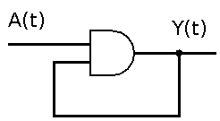
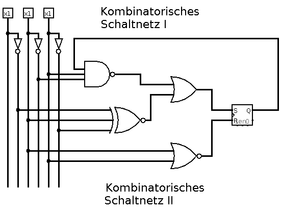

<!--

author:   Sebastian Zug & André Dietrich & Fabian Bär
email:    sebastian.zug@informatik.tu-freiberg.de & andre.dietrich@informatik.tu-freiberg.de & fabian.baer@student.tu-freiberg.de
version:  0.0.2
language: de
narrator: Deutsch Female

import: https://raw.githubusercontent.com/LiaTemplates/NetSwarm-Simulator/master/README.md
import:   https://raw.githubusercontent.com/LiaTemplates/DigiSim/master/README.md

-->

# 04 - Schaltnetze

**TU Bergakademie Freiberg - Wintersemester 2020 / 21**

Link auf die aktuelle Vorlesung im Versionsmanagementsystem GitHub

[https://github.com/TUBAF-IfI-LiaScript/VL_EingebetteteSysteme/blob/00_Einfuehrung](https://github.com/TUBAF-IfI-LiaScript/VL_EingebetteteSysteme/blob/dev/00_Einfuehrung)

Die interaktive Form ist unter diese Link zu finden ->
[TODO]( )

---------------------------------------------------------------------

** Fragen an die Veranstaltung**

+ Erläutern Sie die Notwendigkeit von Speicherelementen für die Umsetzung eines Rechners?
+ Worin besteht der Unterschied zwischen Schaltfunktionen/Schaltnetzen und Schaltwerken?
+ Beschreiben Sie die Eingangsbelegungen und korrespondierenden Zustandsänderungen am RS-Flip-Flop.
+ Welche anderen Flip-Flop-Typen kennen sie, vor liegen die Vorteile gegenüber dem RS-Flip-Flop?
+ Erläutern Sie die Begriffe „zustandsgesteuert“ und „flankengesteuert“.
+ Welche Kernelemente hat ein Schaltwerk? Worin unterscheiden sich die Varianten von Mealy und Moore?
+ Welches Vorgehen ist für die Umsetzung eines Schaltwerkes notwendig?
+ An welcher Stelle ist die invertierte Wahrheitstabelle eines Flip-Flops wichtig?

<!--
style="width: 80%; min-width: 420px; max-width: 720px;"
-->
```ascii

                Abstraktionsebenen

           +----------------------------+ -.
  Ebene 6  | Problemorientierte Sprache |  |
           +----------------------------+  |
                                           ⎬ Anwendungssoftware
           +----------------------------+  |
  Ebene 5  | Assemblersprache           |  |
           +----------------------------+ -.

           +----------------------------+
  Ebene 4  | Betriebssystem             |     Systemsoftware
           +----------------------------+

           +----------------------------+
  Ebene 3  | Istruktionsset             |     Maschinensprache
           +----------------------------+

           +----------------------------+  -.
  Ebene 2  | Mikroarchitektur           |   |
           +----------------------------+   |
                                            ⎬ Automaten, Speicher, Logik
           +----------------------------+   |       ╔═══════════════╗
  Ebene 1  | Digitale Logik             |   |    ◀══║ HIER SIND WIR!║
           +----------------------------+  -.       ╚═══════════════╝

           +----------------------------+
  Ebene 0  | E-Technik, Physik          |     Analoge Phänomene
           +----------------------------+                                      .
```

---------------------------------------------------------------------

## Einführung sequenzieller Logik

Kombinatorische Logik wird durch Schaltnetze repräsentiert, die durch zyklenfreie Graphen dargestellt werden können, sprich es gibt keine Eigenschaften:

1. Zustandslos: Ausgabe ist nur von der Eingabe abhängig;
2. One-Way: keine Rückkopplungen im Schaltnetz;
3. 0-Verzögerung: keine Berücksichtigung der Gatterlaufzeit.

Frage: Können wir die bisherigen Konzepte und Techniken der logischen Schaltungen einsetzen, um wesentliche Elemente eines Rechners zu beschreiben wie z.B. :
+ Ablaufsteuerungen
+ Speicherelemente
+ Takterzeuger

> Merke: Es fehlt ein Speicher!

Was geschieht in einer digitalen Schaltung bei der Rückkopplung eines Gatterausganges ?

__Erster Ansatz: Verwendung eines rückgekoppelten AND-Bausteins.__



| $A(t)$ | $Y(t)$ | $Y(t+\Delta t)$ | $Y(t+2\Delta t)$ | $Y(t+3\Delta t)$ |
| ------ | ------ | --------------- | ---------------- | ---------------- |
| 1      | 1      | 1               | 1                | 1                |
| 0      | 1      | 0               | 0                | 0                |
| 1      | 0      | 0               | 0                | 0                |
| 0      | 0      | 0               | 0                | 0                |

| $A(t)$ | $Y(t+\Delta t)$ | $Y(t+2\Delta t)$ | $Y(t+3\Delta t)$ |
| ------ | --------------- | ---------------- | ---------------- |
| 1      | $Y(t)$          | $Y(t)$           | $Y(t)$           |
| 0      | 0               | 0                | 0                |

Offenbar behalten wir bei der Eingabe von 1 den aktuellen Zustand bei. Aus der Eingabe einer 0 folgt das "Löschen" des Zustandes.

__Zweiter Ansatz: Verwendung eines rückgekoppelten OR-Bausteins.__


| $A(t)$ | $Y(t)$ | $Y(t+\Delta t)$ | $Y(t+2\Delta t)$ | $Y(t+3\Delta t)$ |
| ------ | ------ | --------------- | ---------------- | ---------------- |
| 1      | 1      | 1               | 1                | 1                |
| 0      | 1      | 1               | 1                | 1                |
| 1      | 0      | 1               | 1                | 1                |
| 0      | 0      | 0               | 0                | 0                |

| $A(t)$ | $Y(t+\Delta t)$ | $Y(t+2\Delta t)$ | $Y(t+3\Delta t)$ |
| ------ | --------------- | ---------------- | ---------------- |
| 1      | 1               | 1                | 1                |
| 0      | $Y(t)$          | $Y(t)$           | $Y(t)$           |

...

__Dritter Ansatz: Gesteuerte Rückkopplung über OR-Baustein.__

Wir fügen eine weitere Eingangsgröße hinzu, die die Logik des Speichers auf der Basis des rückgekoppelten OR vervollständigt. Durch die Einbettung des AND Gatters können wir die Rückkopplung kontrollieren! Die Rückkopplung einer 1 erfolgt nur dann, wenn unser `R` Eingang nicht selbst eine 1 abbildet. Sobald wir an S eine 1 anlegen, wird diese auf Y sichtbar und gespeichert.


| $R(t)$ | $S(t)$ | $Y(t)$ | $Y(t+2\Delta t)$ | Bedeutung      |
| ------ | ------ | ------ | ---------------- | -------------- |
| 0      | 0      | 0      | 0                | Speichern$^*$  |
| 0      | 0      | 1      | 1                | Speichern$^*$  |
| 0      | 1      | 0      | 1                | Setzen         |
| 0      | 1      | 1      | 1                | Setzen$^*$     |
| 1      | 0      | 0      | 0                | Rücksetzen$^*$ |
| 1      | 0      | 1      | 0                | Rücksetzen     |
| 1      | 1      | 0      | 0                | Vermeiden$^*$  |
| 1      | 1      | 1      | 0                | Vermeiden      |

Die mit * markierten Einträge sind jeweils flüchtig. Sie werden im nächsten Zyklus durch den Zustand ohne Stern gleicher Kategorie überschrieben.

Daraus folgt die Wertetabelle eines RS-Flip-Flops. Anhand dieser Darstellung wird klar, dass die Eingangsgrößen $R$ und $S$ ihre Kürzel aus gutem Grund tragen `Reset` und `Set`.

| $R(t)$ | $S(t)$ | $Y'(t) = Y(t+2\Delta t)$ |
| ------ | ------ | ------------------------ |
| 0      | 0      | $Y(t)$                   |
| 0      | 1      | 1                        |
| 1      | 0      | 0                        |
| 1      | 1      | nicht erlaubt            |

Nun können wir mit dem Theorem von de Morgan einige Anpassungen vornehmen:

$$\begin{aligned} Y' &= (Y + S) \cdot \overline{R} \\
                     &= \overline{\overline{Y+S} + R}
\end{aligned}$$

Damit sind wir in der Lage unseren bistabilen Speicher mit zwei Gattern gleichen Typs zu realisieren.


Die Darstellung des Flip-Flops kann auch mit Hilfe von NAND Bausteinen erfolgen. Beachten Sie dabei die entsprechend Anpassung der Einganggrößen.


Diese Kombination wird in einem eignen Symbol abstrahiert. Dabei wird unser Ausgang Y nun mit Q bezeichnet.

<!-- style="width: 15%; max-width: 500px" -->

## Anwendungsbeispiele

__Anwendungsbeispiel 1__

motivation_cycles.circ
<e-charts
option='{
"xAxis":{"type":"category","data":[0,1,2,3,4,5,6,7,8,9,10,11,12,13,14]},"yAxis":{"type":"value","show":false},"series":[{"name":"R","type":"line","step":"start","data":[15,15,15,15,15,15,15,15,15,15,15,15,20,20,20,15],"markLine":{"data":[[{"name":"2 * Delta t","xAxis":11,"yAxis":3},{"name":"2 * Delta t","xAxis":13,"yAxis":3}]]}},{"name":"S","type":"line","step":"start","data":[7.5,7.5,12.5,12.5,12.5,7.5,7.5,7.5,7.5,7.5,7.5,7.5,7.5,7.5,7.5,7.5],"markLine":{"data":[[{"name":"2 * Delta t","xAxis":1,"yAxis":3},{"name":"2 * Delta t","xAxis":3,"yAxis":3}]]}},{"name":"Q","type":"line","step":"start","data":[0,0,0,0,5,5,5,5,5,5,5,5,5,5,0,0]}]
}'></e-charts>

<div id="functionPlot" style="width: 55%; max-width: 500px"></div>


__Anwendungsbeispiel 2__


Entprellen eines Schalters


__Anwendungsbeispiel 3__

Rechts Links Lauf eines Motors

## Asynchrone und synchrone Schaltwerke



Wann sind die Werte am Ausgang Q gültig? Die Laufzeit der Schaltnetze bestimmt das Verhalten des Speicherelements!

> Zielstellung: Spezifische Zeiträume zur Übernahme von Eingabe und Ausgabewerten

__asynchrone Schaltwerke__

+ gesteuert durch Veränderung der Eingangssignale
+ Zeitpunkt, an dem wieder stabile Ausgangssignale vorliegen, ist nur durch Gatterlaufzeit festgelegt
+ aufwendiger Entwurf (Zeit ist „Echtzeit“)
+ sehr schnelle Schaltwerke möglich

__synchrone Schaltwerke__

+ gesteuert durch zentralen Takt
+ Übernahme der Änderung eines Eingangssignals erfolgt nur zu festen Zeiten (Zeiträumen oder Zeitpunkten)
+ einfacher, systematischer Entwurf (Zeit ist „Taktzeit“)
+ langsamste Komponente bestimmt maximale Taktfrequenz


## Übungsaufgaben

+ Weisen Sie nach, dass der zweite Ausgang P am RS-Flip-Flop den invertierten Wert von Q realisiert.
