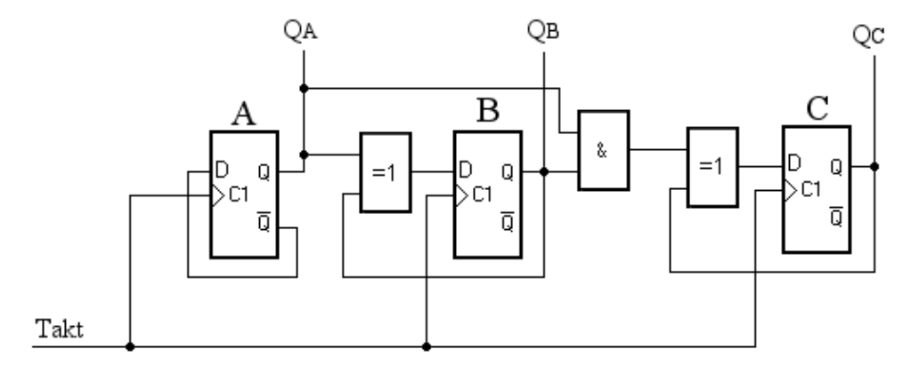
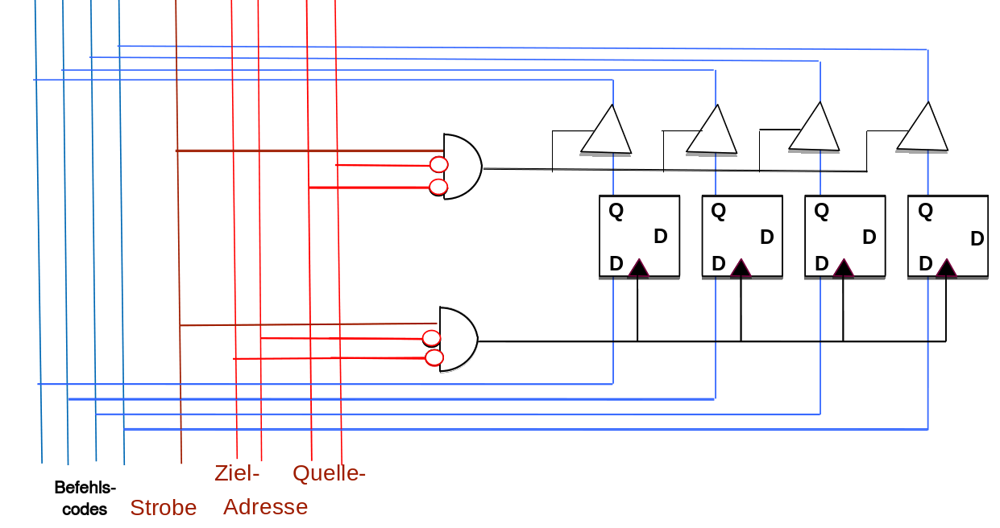
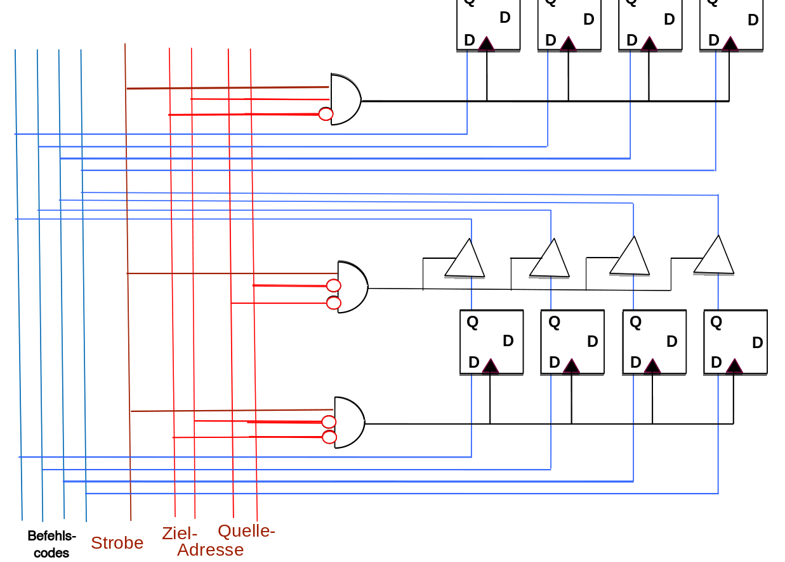

<!--

author:   Sebastian Zug & André Dietrich & Fabian Bär
email:    sebastian.zug@informatik.tu-freiberg.de & andre.dietrich@informatik.tu-freiberg.de & fabian.baer@student.tu-freiberg.de
version:  0.0.3
language: de
narrator: Deutsch Female

import:  https://raw.githubusercontent.com/liascript-templates/plantUML/master/README.md

mark: <span style="background-color: @0;
                                  display: flex;
                                  width: calc(100% + 32px);
                                  margin: -16px;
                                  padding: 6px 16px 6px 16px;
                                  ">@1</span>
red:  @mark(#FF888888,@0)
blue: @mark(lightblue,@0)
gray: @mark(gray,@0)
-->

[](https://liascript.github.io/course/?https://raw.githubusercontent.com/TUBAF-IfI-LiaScript/VL_EingebetteteSysteme/master/10_CPU_Basis.md#1)

# Von mathematischen Operationen zur CPU

| Parameter            | Kursinformationen                                                                                                                                                                                          |
| -------------------- | ---------------------------------------------------------------------------------------------------------------------------------------------------------------------------------------------------------- |
| **Veranstaltung:**   | `Digitale Systeme / Eingebettete Systeme`                                                                                                                                                  |
| **Semester**         | `Wintersemester 2022/23`                                                                                                                                                                   |
| **Hochschule:**      | `Technische Universität Freiberg`                                                                                                                                                                          |
| **Inhalte:**         | `Realisierung grundlegender arithmetischer Operationen im Rechner`                                                                                                                                  |
| **Link auf GitHub:** | [https://github.com/TUBAF-IfI-LiaScript/VL_Softwareentwicklung/blob/master/10_CPU_Basis.md](https://github.com/TUBAF-IfI-LiaScript/VL_EingebetteteSysteme/blob/master/10_CPU_Basis.md) |
| **Autoren**          | @author                                                                                                                                                                                |


---------------------------------------------------------------------

** Fragen an die Veranstaltung**

+ Welche Funktionalität sollte eine ALU bereitstellen?
+ Wie werden Programmierbefehle umgesetzt und im Speicher abgebildet?
+ Welche Aufgaben hat das Steuerwerk?

--------------------------------------------------------------------

<!--
style="width: 80%; min-width: 420px; max-width: 720px;"
-->
```ascii

                Abstraktionsebenen

           +----------------------------+ -.
  Ebene 6  | Problemorientierte Sprache |  |
           +----------------------------+  |
                                           ⎬ Anwendungssoftware
           +----------------------------+  |
  Ebene 5  | Assemblersprache           |  |
           +----------------------------+ -.

           +----------------------------+
  Ebene 4  | Betriebssystem             |     Systemsoftware
           +----------------------------+

           +----------------------------+
  Ebene 3  | Istruktionsset             |     Maschinensprache
           +----------------------------+

           +----------------------------+  -.      ╔═══════════════╗
  Ebene 2  | Mikroarchitektur           |   |   ◀══║ HIER SIND WIR!║
           +----------------------------+   |      ╚═══════════════╝
                                            ⎬ Automaten, Speicher, Logik
           +----------------------------+   |
  Ebene 1  | Digitale Logik             |   |
           +----------------------------+  -.

           +----------------------------+
  Ebene 0  | E-Technik, Physik          |     Analoge Phänomene
           +----------------------------+                                      .
```

---------------------------------------------------------------------

## Ausgangspunkt

> **Aufgabe:** Welche Funktionalität verbirgt sich hinter folgenden Schaltwerken/ Schaltnetze?

{{1}}
Synchroner 3-Bit-Zähler auf der Basis von JK Flip-Flops

<!-- style="width: 50%; max-width: 800px;" -->

---------------------------------------------------------------------

{{1}}
4-Bit PIPO Schieberegister (Links-Rechts)

<!-- style="width: 70%; max-width: 800px;" -->

---------------------------------------------------------------------

[^Alnoaman]: Ali Alnoaman, Foreneintrag Electrical Engineering, [Link](https://electronics.stackexchange.com/questions/443939/need-a-simple-explanation-of-a-left-right-shift-register)

{{1}}
1 Bit Volladdierer

<!-- style="width: 35%; max-width: 600px;" -->


## Schritt 1 - Operationsauswahl

Zwischenstand

| Stufe | Funktionalität                                                       | Wunschzettel                                                     |
|-------|----------------------------------------------------------------------|------------------------------------------------------------------|
| 0     | Addition/Subtraktion von einzelnen Werten $\color{green} \mathbf{✓}$ |                                                                  |
| 1     |                                                                      | Flexibles Handling mehrerer Operationen $\color{red} \mathbf{?}$ |

Logische Funktionen: NOT, AND, NOR, XOR

Arithmetische Funktionen: ADD, SUB, (MUL), (DIV)

Sonstige: SHIFT LEFT (arithmetisch, logisch), SHIFT RIGHT (arithmetisch, logisch)

```text @plantUML.png
@startditaa
             Daten                 Daten
               |                     |
               |                     |
+--------------|---------------+     |
| +------+     |               |     |     Funktionsauswahl
| |      |     |               :     |        F_0 F_1 F_2
| |      V     V               V     V         |   |   | Zielregister
| | +----+-----+-----+    +----+-----+-----+   |   |   |  auswahl
| | |cBFB Register A |    |cBFB Register B |   |   |   |     Z
| | +---+------------+    +---------+------+   |   |   |     |
| |     |                           |          |   |   |     |
| |     |        +------------------+          |   |   |     |
| |     |        |                  |          |   |   |     |
| |     +--------+-----------+      |          |   |   |     |
| |     |        |           |      |          |   |   |     |
| |     V        V           V      V          |   |   |     |
| | +----------------+    +----------------+   |   |   |     |
| | |c808            |<-  |c808            |<--+   |   |     |
| | | Demultiplexer  |<-  | Demultiplexer  |<------+   |     |
| | |                |<-  |                |<----------+     |
| | ++-+-+-+-+-+-+-+-+    ++-+-+-+-+-+-+-+-+                 |
| |  | | | | | | | |       | | | | | | | |                   |
| |  | | | | | | | |       V V V V V V V V                   |
| |  | | | | | | | +----------------------------------+      |
| |  | | | | | | +-----------------------------+      |      |
| |  | | | | | +------------------------+      |      |      |
| |  | | | | +-------------------+      |      |      |      |
| |  | | | +--------------+      |      |      |      |      |
| |  | | +---------+      |      |      |      |      |      |
| |  | +----+      |      |      |      |      |      |      |
| |  |      |      |      |      |      |      |      |      |
| |  |  |   |  |   |  |   |  |   |  |   |  |   |  |   |  |   |
| |  V  V   V  V   V  V   V  V   V  V   V  V   V  V   V  V   |
| | +----+ +----+ +----+ +----+ +----+ +----+ +----+ +----+  |
| | | 000| | 001| | 010| | 011| | 100| | 101| | 110| | 111|  |
| | |cFF4| |cFF4| |cFF4| |cFF4| |cFF4| |cFF4| |cFF4| |cFF4|  |
| | | OR | |AND | |EXOR| |ADD | |SUB | |MUL | |DIV | | SL |  |
| | +-+--+ +-+--+ +-+--+ +-+--+ +-+--+ +-+--+ +-+--+ +-+--+  |
| |   :      :      :      :      :      :      :      :     |
| |   +------+------+------+---+--+------+------+------+     |
| |                            |                             |
| |                            V                             |
| |                 +----------+----------+                  |
| |                 |cCCB DeMuxer/Selektor|<-----------------+
| |                 +---+-+---------------+
| |                     : :                     |      |
| +---------------------+ |                   --+---+--+
|                         |                         | Status
+-------------------------+                         v S
@endditaa
```

Der Status S umfasst eine Zusammenstellung der Resultate der Operationen codiert als 1-Bit Werte:

+ `Carry` - Flag für die Addition / Multiplikation
+ `Overflow` - Flag
+ `Error`- Flag für die Division durch Null
+ ...

Wie "programmieren" wir unser System?

<!-- data-type="none" -->
| F_0 | F_1 | F_2 | Z | Bezeichnung |
|-----|-----|-----|---|-------------|
| 0   | 0   | 0   | 0 | `OR_A`      |
| 0   | 0   | 0   | 1 | `OR_B`      |
| ... |     |     |   |             |
| 0   | 1   | 1   | 0 | `ADD_A`     |
| 0   | 1   | 1   | 1 | `ADD_B`     |
| ... |     |     |   |             |

Beispielanwendungen

|              | Inkrementieren   | Togglen          |
|--------------|------------------|------------------|
| Vorbereitung | A <- 1, B <-0    | A <- 1           |
| "Programm"   | `ADD_B` $(0111)$ | `EOR_A` $(0101)$ |
|              | `ADD_B` $(0111)$ | `EOR_A` $(0101)$ |
|              | `ADD_B` $(0111)$ | `EOR_A` $(0101)$ |


## Schritt 2 - Sequenz von Berechnungen

Zwischenstand

| Stufe | Funktionalität                                                                                             | Wunschzettel                                                                                                                                                                                         |
|-------|------------------------------------------------------------------------------------------------------------|------------------------------------------------------------------------------------------------------------------------------------------------------------------------------------------------------|
| 0     | Addition/Subtraktion von einzelnen Werten $\color{green} \mathbf{✓}$                                       |                                                                                                                                                                                                      |
| 1     | Arithmetische Einheit mit mehren Funktionen und wählbarem Ergebnisregister      $\color{green} \mathbf{✓}$ |                                                                                                                                                                                                      |
| 2     |                                                                                                            | Sequenz von Berechnungsfolgen  $\color{red} \mathbf{?}$ $$\begin{aligned} & Reg\_A \leftarrow 3 \\ & Reg\_B \leftarrow 2 \\ & ADD\_B \\ & Reg\_A \leftarrow -3 \\ & MUL\_B  \\ & ... \end{aligned}$$ |

Für diesen Schritt fassen wir das obige Schaltbild unserer hypothetischen ALU mit 8 Funktionen in einem abstrakteren Schaubild zusammen.

```text @plantUML.png
@startditaa
           +-----+-----+
           |  A  |  B  |
    Daten  +-----+-----+
<--------->+cFF4       |
           |           |
 Kontrolle |    ALU    |
---------->+           |
           |           |
   Status  |           |
<----------+           |
           +-----------+
@endditaa
```


| Bezeichnung | Bedeutung                               |
|-------------|-----------------------------------------|
| A, B        | Datenregister                           |
| Daten       | Zugriff auf die Datenregister           |
| Kontrolle   | Steuerleitungen $F_0$ bis $F_2$ und $Z$ |
| Status      | Carry oder Fehlerflags                  |

Wir erweitern diese ALU-Komponenten nun um zwei weitere Module - einen Speicher und ein Steuerwerk.
Der Speicher umfasst unsere Programmbestandteile `AND_B` usw. in jeweils einem 4 Bit breiten Register.

<!-- style="width: 100%; max-width: 500px" -->

<!-- style="width: 100%; max-width: 500px" -->

Analog zur Diskussion um die abstraktere Darstellung der ALU fassen wir auch den Speicher in einem Block-Symbol zusammen.

```text @plantUML.png
@startditaa
               +------------------+
               |c88F              |
               |     Speicher     |
               |                  |
               +-----------+------+
                           |
                           |
                           |               +-----+-----+
                           |               |  A  |  B  |
                           |        Daten  +-----+-----+
                           |     --------->+cFF4       |
                           |    Kontrolle  |           |
                           +-------------->+    ALU    |
                                   Status  |           |
                                  <--------+           |
                                           +-----------+
@endditaa
```


Wie allerdings setzen wir den Fortschritt im Programm um? Nach welcher Methodik werden die nachfolgenden Befehle aufgerufen?

Eine weitere Komponente, das Steuerwerk übernimmt diese Aufgabe. Anstatt nun eine Folge von Kontrollflags vorzugeben, erzeugen wir intern eine Folge von Adressen, die auf Speicherbereiche verweisen, in denen die Konfigurationen der ALU hinterlegt sind.

```text @plantUML.png
@startditaa
               +------------------+
               |c88F              |
               |     Speicher     |
               |                  |
               +-----------+------+
                       ^   |
                       |   |
+----------+  Adresse  |   |               +-----+-----+
|cF88      +-----------+   |               |  A  |  B  |
|          |               |        Daten  +-----+-----+
|          |               |     --------->+cFF4       |
|  Adress- |               |    Kontrolle  |           |
|berechnung|               +-------------->+    ALU    |
|          |                       Status  |           |
|          |                      <--------+           |
+----------+                               +-----------+
@endditaa
```

Allerdings bleibt bei dieser Konfiguration unser Status auf der Strecke! Im Grund müssen wir die Information dazu aber Operationsspezifisch auswerten. Es genügt also nicht allein eine Adressberechung zu realsieren, vielmehr bedarf es einer generellen Steuerungskomponente, die die Ausführung von Befehlen initiiert und überwacht.

```text @plantUML.png
@startditaa
               +------------------+
               |c88F              |
               |     Speicher     |
               |                  |
               +---------+-+------+
                       ^ |
                       | |
+----------+  Adresse  | |                 +-----+-----+
|cF88      +-----------+ |                 |  A  |  B  |
|          |             |          Daten  +-----+-----+
|          |   Befehl    |        -------->+cFF4       |
|  Steuer- |<------------+                 |           |
|   werk   |                     Kontrolle |    ALU    |
|          +------------------------------>+           |
|          |                               |           |
|          |                       Status  |           |
|          +<------------------------------+           |
+----------+                               +-----------+
@endditaa
```

Das Steuerwerk ist nun dafür verantwortlich:

+ Adressen zu berechnen
+ Befehle zu interpretieren
+ die ALU über entsprechende Flags zu konfigurieren
+ die Statusinformationen entsprechend dem aktuellen Befehl auszuwerten

Wir lösen uns von dem Zugriff auf die Kontrollbits und etablieren abstrakte Befehle.

> **Merke:** Das Steuerwerk entkoppelt die Konfiguration einzelner Komponenten und die Befehlsdarstellung.

## Schritt 3 - Handhabung der Daten

Zwischenstand

| Stufe | Funktionalität                                                                                             | Wunschzettel                                                                                                                                                                                                                                      |
|-------|------------------------------------------------------------------------------------------------------------|---------------------------------------------------------------------------------------------------------------------------------------------------------------------------------------------------------------------------------------------------|
| 0     | Addition/Subtraktion von einzelnen Werten $\color{green} \mathbf{✓}$                                       |                                                                                                                                                                                                                                                   |
| 1     | Arithmetische Einheit mit mehren Funktionen und wählbarem Ergebnisregister      $\color{green} \mathbf{✓}$ |                                                                                                                                                                                                                                                   |
| 2     | Sequenz von Berechnungsfolgen    $\color{green} \mathbf{✓}$                                                |                                                                                                                                                                                                                                                   |
| 3     |                                                                                                            | Freie Definition von Operanden  $\color{red} \mathbf{?}$     $$\begin{aligned} & \color{red}{Reg\_A \leftarrow 3}  \\ & \color{red}{Reg\_B \leftarrow 2} \\ & ADD\_B \\ & \color{red}{Reg\_A \leftarrow -3} \\ & MUL\_B  \\ & ... \end{aligned}$$ |

Wo kommen aber die Daten her? Bislang haben wir uns damit begnügt anzunehmen, dass diese auf "magische" Art und Weise in unseren Registern stehen.

```text @plantUML.png
@startditaa
               +------------------+
               |c88F              |
               |     Speicher     |
               |                  |
               +---------+-+------+
                       ^ | ^
                       | | |
+----------+  Adresse  | | |               +-----+-----+
|cF88      +-----------+ | |               |  A  |  B  |
|          |             | |        Daten  +-----+-----+
|          |   Befehl    | +-------------->+cFF4       |
|  Steuer- |<------------+                 |           |
|   werk   |                     Kontrolle |    ALU    |
|          +------------------------------>+           |
|          |                               |           |
|          |                       Status  |           |
|          |<------------------------------+           |
+----------+                               +-----------+
@endditaa
```

Im Speicher stehen nun nicht nur Befehle für die Ausführung unserer ALU-Funktionen, sondern auch die Daten für unsere Berechnungen. Auf diese verweisen wir mit separaten Befehlen.

<!-- data-type="none" -->
| Befehle       | Codierung        | Bedeutung                                           |
|---------------|------------------|-----------------------------------------------------|
| `OR_A`        | $0000$ bisher(!) | Logisches Oder                                      |
|               | ....             |                                                     |
| `LDA Adresse` | $10000$          | Laden der Daten von der Adresse X in das Register A |
| `LDB Adresse` | $10001$          | Laden der Daten von der Adresse X in das Register B |
| `STA Adresse` | $10010$          | Speichern der Daten aus Register A an der Adresse X |
| `STB Adresse` | $10011$          | Speichern der Daten aus Register B an der Adresse X |

Damit nimmt der Aufwand im Steuerwerk nochmals signifikant zu! Neben dem Adressbus besteht nun ein Datenbus als weiterer Kommunikationspfad.

| Schritt | Vorgang                                                                               |
|---------|---------------------------------------------------------------------------------------|
| 0       | Lesen eines Befehls aus dem Speicher                                                  |
| 1       | Erkennen, dass es sich um ein `LDA` handelt - Eine Berechnung ist nicht erforderlich. |
| 2       | Verschieben des Adresszählers auf die nächste Speicherstelle                          |
| 3       | Aktivieren eines schreibenden Zugriffs auf das Register A der ALU                     |
| 4       | Umleiten der Inhalte aus dem Speicher an die ALU (anstatt an das Steuerwerk)          |

> **Achtung:** Offenbar haben wir jetzt 2 Kategorien von Befehlen! `ADD_A` oder `OR_B` werden in einem Zyklus ausgeführt. Die `LDA` oder `STB` Befehle brauchen ein Nachladen der zusätzlichen Parameter (hier Daten).

## Schritt 4 - Ein- und Ausgaben

Zwischenstand

| Stufe | Funktionalität                                                                                             | Wunschzettel                                                   |
|-------|------------------------------------------------------------------------------------------------------------|----------------------------------------------------------------|
| 0     | Addition/Subtraktion von einzelnen Werten $\color{green} \mathbf{✓}$                                       |                                                                |
| 1     | Arithmetische Einheit mit mehren Funktionen und wählbarem Ergebnisregister      $\color{green} \mathbf{✓}$ |                                                                |
| 2     | Sequenz von Berechnungsfolgen    $\color{green} \mathbf{✓}$                                                |                                                                |
|       | Darstellung von Programmen als Sequenzen abstrakter Befehle  $\color{green} \mathbf{✓}$                    |                                                                |
| 3     | Flexibler Zugriff auf Daten und Programme im Speicher     $\color{green} \mathbf{✓}$                       |                                                                |
|       |                                                                                                            | Ein- und Ausgabe von Daten wäre schön $\color{red} \mathbf{?}$ |


Das Steuerwerk koordiniert neben der ALU die Ein- und Ausgabeschnittstelle.

```text @plantUML.png
@startditaa
               +------------------+
               |c88F              |
               |     Speicher     |
               |                  |
               +---------+-+------+
                       ^ | ^
                       | | |
+----------+  Adresse  | | |               +-----+-----+
|cF88      +-----------+ | |               |  A  |  B  |
|          |             | |        Daten  +-----+-----+
|          |   Befehl    | +-------------->+cFF4       |
|  Steuer- |<------------+                 |           |
|   werk   |                     Kontrolle |    ALU    |
|          +------------------------------>+           |
|          |                               |           |
|          |                       Status  |           |
|          |<------------------------------+           |
|          |                               |           |
|          | Kontrolle                     |           |
|          +-------------+         Daten   |           |
|          |             | +-------------->|           |
|          |  Status     | |               |           |
|          |<----------+ | |               |           |
+----------+           | | |               +-----------+
                       | | |
                       | V V
               +-------+-----------+
               |c8F8               |
               |    Ein/Ausgabe    |
               |                   |
               +-------------------+
@endditaa
```

## 1945:  Von-Neumann Architektur

John von Neumann beschrieb 1945 in seinem Aufsatz ”First Draft of a Report on the EDVAC“ ein strukturelles Konzept, wonach Computerprogramme und die zu verarbeitenden Daten zusammen im gleichen Speicher abgelegt werden sollten. [Link](http://abelgo.cn/cs101/papers/Neumann.pdf)

Einige der Ideen des Konzepts wurden bereits von Konrad Zuse erkannt und teilweise in der Z1 und der Z3 realisiert.

```text @plantUML.png
@startditaa
  ^  |
  |  V
+-+----+    +----------------------------+
|c8F8  |    |c88F   Speicherwerk         |
|      |<-->|   +--------+  +--------+   |
|      |    |   |Programm|  | Daten  |   |
|      |    |   +--------+  +--------+   |
|      |    +------+---------------------+
|      |        ^  |             ^
| E/A- |        :  |             |
| Werk |        |  V             V
|      |    +---+------+    +------------+
|      |    |cF88      |    | Rechenwerk |
|      |    |          |    |cFF4        |
|      |    |          |<-=-+ +--------+ |
|      |<-=-+Steuerwerk|    | |Register| |
|      |    |          +-=->| +--------+ |
|      |    |          |    | |  ALU   | |
|      |    |          |    | +--------+ |
+------+    +----------+    +------------+
@endditaa
```

## Hausaufgaben

1. Vergleichen Sie die von-Neumann-Architektur und die Harvard Architektur. Welche Vor- und Nachteile finden sich?
2. Welche Schritte sind notwendig, um einen oder sehr viele neue(n) Befehl(e) zu integrieren? Woran müssen wir arbeiten?
