<!--

author:   Sebastian Zug & André Dietrich & Fabian Bär
email:    sebastian.zug@informatik.tu-freiberg.de & andre.dietrich@informatik.tu-freiberg.de & fabian.baer@student.tu-freiberg.de
version:  0.1.4
language: de
narrator: Deutsch Female

import:  https://raw.githubusercontent.com/liascript-templates/plantUML/master/README.md
         https://github.com/LiaTemplates/Pyodide
         https://github.com/LiaTemplates/AVR8js/main/README.md#10
         https://github.com/liascript/CodeRunner

mark: <span style="background-color: @0;
                                  display: flex;
                                  width: calc(100% + 32px);
                                  margin: -16px;
                                  padding: 6px 16px 6px 16px;
                                  ">@1</span>
red:  @mark(#FF888888,@0)
blue: @mark(#898AE3,@0)
gray: @mark(gray,@0)
-->


<!--

author:   Sebastian Zug & André Dietrich & Fabian Bär
email:    sebastian.zug@informatik.tu-freiberg.de & andre.dietrich@informatik.tu-freiberg.de & fabian.baer@student.tu-freiberg.de
version:  0.0.5
language: de
narrator: Deutsch Female

import:  https://raw.githubusercontent.com/liascript-templates/plantUML/master/README.md
         https://github.com/LiaTemplates/Pyodide

mark: <span style="background-color: @0;
                                  display: flex;
                                  width: calc(100% + 32px);
                                  margin: -16px;
                                  padding: 6px 16px 6px 16px;
                                  ">@1</span>
red:  @mark(#FF888888,@0)
blue: @mark(#898AE3,@0)
gray: @mark(gray,@0)
-->

[](https://liascript.github.io/course/?https://raw.githubusercontent.com/TUBAF-IfI-LiaScript/VL_EingebetteteSysteme/master/13_AVR_CPU.md#1)

# Programmierung CPU

| Parameter            | Kursinformationen                                                                                                                                                                      |
| -------------------- | -------------------------------------------------------------------------------------------------------------------------------------------------------------------------------------- |
| **Veranstaltung:**   | `Eingebettete Systeme`                                                                                                                                                                 |
| **Semester**         | `Wintersemester 2021/22`                                                                                                                                                               |
| **Hochschule:**      | `Technische Universität Freiberg`                                                                                                                                                      |
| **Inhalte:**         | `Einführung AVR Architektur`                                                                                                                                                           |
| **Link auf GitHub:** | [https://github.com/TUBAF-IfI-LiaScript/VL_Softwareentwicklung/blob/master/13_AVR_CPU.md](https://github.com/TUBAF-IfI-LiaScript/VL_EingebetteteSysteme/blob/master/13_AVR_CPU.md) |
| **Autoren**          | @author                                                                                                                                                                                |


---------------------------------------------------------------------

** Fragen an die Veranstaltung**

+ Erläutern Sie den Unterschied zwischen Mikroprozessor und Mikrocontroller!
+ Welche Speichertypen werden bei Mikrocontrollern eingesetzt?
+ Welcher Idee steht hinter dem „Memory-Mapped-IO“?
+ Warum haben unterschiedliche Komponenten des Mikrocontrollers verschiedene Taktraten?
+ Welche Aufgabe haben die Pull-Up-Widerstände für Pins?
+ Welche Grundbestandteile hat ein disassembliertes AVR Mikrocontrollerprogramm?
+ Was passiert nachdem der Reset-Pin eines AVR Mikrocontrollers auf GND gezogen wurde?

<!--
style="width: 80%; min-width: 420px; max-width: 720px;"
-->
```ascii

                Abstraktionsebenen

           +----------------------------+ -.
  Ebene 6  | Problemorientierte Sprache |  |
           +----------------------------+  |
                                           ⎬ Anwendungssoftware
           +----------------------------+  |        ╔═══════════════╗
  Ebene 5  | Assemblersprache           |  |     ◀══║ HIER SIND WIR!║
           +----------------------------+ -.        ╚═══════════════╝

           +----------------------------+
  Ebene 4  | Betriebssystem             |     Systemsoftware
           +----------------------------+   

           +----------------------------+   
  Ebene 3  | Istruktionsset             |     Maschinensprache
           +----------------------------+     

           +----------------------------+  -.
  Ebene 2  | Mikroarchitektur           |   |
           +----------------------------+   |
                                            ⎬ Automaten, Speicher, Logik
           +----------------------------+   |
  Ebene 1  | Digitale Logik             |   |
           +----------------------------+  -.

           +----------------------------+
  Ebene 0  | E-Technik, Physik          |     Analoge Phänomene
           +----------------------------+                                      .
```

---------------------------------------------------------------------

## Motivation

Für unseren Modellrechner haben wir anhand der Von-Neumann-Architektur 4 verschiedene Basiselemente unterschieden:

+ Speicherwerk
+ Rechenwerk
+ Steuerwerk / Kontrolleinheit
+ Eingabe/Ausgabe

```text @plantUML.png
@startuml
ditaa
               +------------------+
               |c88F              |
               |     Speicher     |
               |                  |
               +---------+-+------+
                       ^ | ^
                       | | |
+----------+  Adresse  | | |               +-----+-----+
|cF88      +-----------+ | |               |  A  |  B  |
|          |             | |        Daten  +-----+-----+
|          |   Befehl    | +-------------->+cFF4       |
|  Steuer- |<------------+                 |           |
|   werk   |                     Kontrolle |    ALU    |
|          +------------------------------>+           |
|          |                               |           |
|          |                       Status  |           |
|          |<------------------------------+           |
|          |                               |           |
|          | Kontrolle                     |           |
|          +-------------+         Daten   |           |
|          |             | +-------------->|           |
|          |  Status     | |               |           |
|          |<----------+ | |               |           |
+----------+           | | |               +-----------+
                       | | |
                       | V V
               +-------+-----------+
               |c8F8               |
               |    Ein/Ausgabe    |
               |                   |
               +-------------------+
@enduml
```


**Was wollen wir aber eigentlich erreichen?**

Beispiel 1: Wallplotter

<iframe width="560" height="315" src="https://www.youtube.com/embed/byBueGMv4J8" frameborder="0" allow="accelerometer; autoplay; clipboard-write; encrypted-media; gyroscope; picture-in-picture" allowfullscreen></iframe>

Beispiel 2: Autonome Schwimmplattform

<!-- style="width: 95%; max-width: 900px" -->[^1]

<!--
style="width: 70%; max-width: 720px; display: block; margin-left: auto; margin-right: auto;"
-->
```ascii

       +----------+        +----------+                                
     +-+--------+ |     +--+--------+ |     +----------+     +----------+
+--> |Sensorik  +-+ --> | Filterung +-+ --> | Regelung | --> | Aktorik  | ---+
|    +----------+       +-----------+       +----------+     +----------+    |
|                                                                            |
|                              .---------------------.                       |
+----------------------------- | Umgebung            | <---------------------+
                               .---------------------.
```

**Was fehlt uns für die Umsetzung?**

1. eine praktische Realisierung unserer Prozessorarchitektur (Spannungsversorgung, Taktgeber, usw.)
2. eine Erweiterung der Fähigkeiten unseres Prozessors (Analoge Eingänge, Zeitmessung, Verarbeitung von Gleitkommawerten, usw.)
3. eine effiziente Programmiermöglichkeit in einer Hochsprache
4. Konzepte für die Implementierung von eingebetteten Systemen, die sich von konventionellen Rechnerlösungen in verschiedenen Punkten unterscheiden.

In den kommenden Vorlesungen wollen wir diese Anforderungen ausgehend von unseren bisher erlangten Kenntnissen aufgreifen und konkretisieren. Die Übungen adressieren dies Konzepte dann auf der praktischen Ebene.

## Mikroprozessor vs. Mikrocontroller

Das Bild zeigt einen ATtiny Prozessor

<!-- style="width: 75%; max-width: 500px" -->

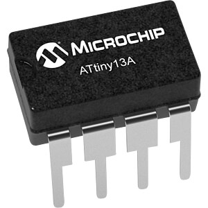<!-- style="width: 20%; max-width: 200px" -->

[^ATtiny]: Firma Microchip, Handbuch AtTiny Family, https://ww1.microchip.com/downloads/en/DeviceDoc/Atmel-2586-AVR-8-bit-Microcontroller-ATtiny25-ATtiny45-ATtiny85_Datasheet.pdf

Mit den farblich hervorgehobenen Elementen lässt sich aber nur wenig anfangen. Wir haben Berechnungen über Zahlenwerten ausgeführt, die wir im Programmspeicher abgelegt haben. Entsprechend ergänzt der reale Prozessor diese Elemente um:

+ Zusätzliche Funktionalität

  + Timerbausteine
  + Analoge Eingänge
  + Digitale Eingänge
  + Interruptsystem

 + Betriebskomponenten

  + Taktgeber
  + Monitoring und Überwachungselemente
  + Spannungsversorgung

```text @plantUML.png
@startuml
ditaa

+---------------------------------------------------------------------+
| Mikrocontroller                                                     |
| +-------------------+  +-------------------+  +-------------------+
| | Interrupt         |  | Floating Point    |  | Debug Interface   | |
| | Controller        |  | Unit (FPU)        |  |                   | |
| +-------------------+  +-------------------+  +-------------------+ |
|                                                                     |
| +-------------------+  +-------------------+  +-------------------+ |
| | Analog-Digital    |  | Mikroprozessor    |  | Timer und Zähler  | |
| | Wandler           |  |             c8F8  |  |                   | |
| +-------------------+  +-------------------+  +-------------------+ |
|                                                                     |
| +-------------------+  +-------------------+  +-------------------+ |
| | Takterzeugung     |  | Speicher          |  | Schnittstellen    | |
| |                   |  |                   |  | z.B. Seriell      | |
| +-------------------+  +-------------------+  +-------------------+ |
+---------------------------------------------------------------------+
@enduml
```
> **Merke:** Der Übergang zwischen Mikrocontrollern und Mikroprozessoren ist fließend!

Damit wird es möglich rund um den Mikroprozessor weitere periphere Komponenten anzuordnen und damit einen spezifischen Mikropcontroller zu designen.

Das Werbematerial der vormaligen Firma AVR macht das anhand einer Grafik deutlich:

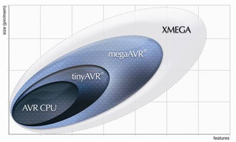<!-- style="width: 55%; max-width: 500px" -->

[^2]: Firma Atmel Webseite

Den Tiny Controller hatten wir in seiner Architektur bereits gesehen. Schon ein Atmega32U4 bringt einen deutlich größeren Umfang an Peripherie mit.


[^megaAVR]: Firma Microchip, megaAVR® Data Sheet, [Link](http://ww1.microchip.com/downloads/en/DeviceDoc/ATmega48A-PA-88A-PA-168A-PA-328-P-DS-DS40002061A.pdf)

[^AtmelHandbuch]:

Einen umfangreicheren Überblick zu den 8-Bit Controllern der Firma Microchip gibt die Aufstellung unter dem [Link](
https://ww1.microchip.com/downloads/en/DeviceDoc/30010135E.pdf)

Das Konzept einer Mikrocontroller-Familie mit einem gemeinsamen "Kern" findet sich insbesondere bei den auf der ARM Architektur basierenden Implementierungen wieder.

Die ARM Cortex-M-Familie (32 Bit System) sind ARM-Mikroprozessor-Cores, die für den Einsatz in Mikrocontrollern, ASICs, ASSPs, FPGAs und SoCs konzipiert sind. Cortex-M-Cores werden üblicherweise als dedizierte Mikrocontroller-Chips verwendet, sind aber auch "versteckt" in SoC-Chips als Power-Management-Controller, I/O-Controller, System-Controller, Touchscreen-Controller, Smart-Battery-Controller und Sensor-Controller. Arm Holdings fertigt und verkauft keine CPU-Bausteine, die auf eigenen Designs basieren, sondern lizenziert die Prozessorarchitektur an Interessenten.  
Entsprechend findet sich ein und der selbe Mikroprozessor in sehr vielen Controllern unterschiedlicher Hersteller wieder.

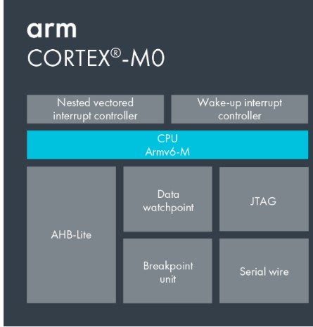<!-- style="width: 45%; max-width: 500px" -->

[^4]: Firma STMicroelectronics, Arm® Cortex®-M0 in a nutshell, [Link](https://www.st.com/content/st_com/en/arm-32-bit-microcontrollers/arm-cortex-m0.html?icmp=tt18626_gl_lnkon_nov2020)

<!-- style="width: 75%; max-width: 500px" -->

[^5]: Firma STMicroelectronics, STM32F0 Series, [Link](https://www.st.com/en/microcontrollers-microprocessors/stm32f0-series.html?icmp=tt18625_gl_lnkon_nov2020)

## Kenngrößen eines Controllers

Feature/Parameter des Controllers
---------------------------------------------

+ x-Bit-Architektur
+ vorhandene Peripheriebausteine (Kommunikationsschnittstellen, Debug-Interfaces, Gleitkomma-Recheneinheiten)
+ maximale/minimale Taktrate
+ Größe des internen / extern anschließbaren Speichers
+ Energieverbrauch
+ ...
+ Bibliotheken
+ unterstützte Programmiersprachen
+ Debuging-Interfaces
+ garantierte Lieferbarkeit

### Handhabung

<!-- style="width: 100%; max-width: 700px" -->

Grundsätzlich unterscheidet man bei elektronischen Bauteilen zwischen:

+ „durchsteckmontierbaren“ (Through Hole Technology – THT) und
+ „oberflächenmontierbaren“ (Surface Mounted Technologys – SMT)

Bauformen. „Surface Mounted Devices – SMD“ bezieht sich auf ein Bauteil der vorgenannten Gruppe. Durchsteck-Teile benötigen zusätzliche Arbeitsschritte und werden in hochautomatisiert gefertigten Platinen nur aus Gründen der Stabilität realisiert.

Das Rastermaß der Pins wird aus historischen Gründen im Zoll-Basis (25,4mm) beschrieben. Das „Grundmaß“ war demzufolge das Zoll und für kleine Maße wurde meist das `mil` verwendet (1⁄1000 Zoll = 25,4 µm). Im Zuge der Internationalisierung setzen sich immer mehr die metrischen Maße durch, so dass typische Pitches heute bei z. B. 0,5 mm liegen.

| Bezeichnung | Bedeutung                                                                          |
| ----------- | ---------------------------------------------------------------------------------- |
| DIP / DIL   | Dual In-Line (Package) meist im Raster 2,54 mm (=100 mil)                          |
| xQFP        | (Low Profile / Thin) Quad Flat Package Pins an vier Seiten, Raster 1,27 bis 0,4 mm |
| xPGA        | (Plastic / Ceramic) Pin Grid Array mit Pin-Stiften an der Unterseite               |
| xBGA            |  Ball Grid Array Package mit kleinen Lotkügelchen an der Unterseite                                                                                   |

Das Gehäuse schützt den Mikrocontroller vor Umwelteinflüssen. Achten Sie bei der Auswahl insbesondere auf den Temperaturbereich!

Für unseren Controller gibt das Handbuch einen zulässigen Temperaturbereich von -40°C to 85°C an. Dabei ist aber kein vollständig identisches Verhalten innerhalb dieses Spektrums zu erwarten. Vielmehr unterscheiden sich die Stromaufnahme und die Verlässlichkeit der Speicherelemente:

_Reliability Qualification results show that the projected data retention failure rate is much less than 1 PPM over 20 years at 85°C or 100 years at 25°C_ ([Handbuch](http://ww1.microchip.com/downloads/en/DeviceDoc/ATmega48A-PA-88A-PA-168A-PA-328-P-DS-DS40002061A.pdf), Seite 17)

### Atmega328 Controller

Das Datenblatt des Controllers findet sich unter anderem hinter folgendem [Link](http://ww1.microchip.com/downloads/en/DeviceDoc/ATmega48A-PA-88A-PA-168A-PA-328-P-DS-DS40002061A.pdf).

Die Namensgebung ergibt sich dabei aus der Speichergröße des verwendeten Typs:

<!-- data-type="none" -->
| Device            |           Flash |         EEPROM |            RAM | Interrupt Vector Size             |
| ----------------- | ---------------:| --------------:| --------------:| --------------------------------- |
| ATmega48A         |         4KBytes |       256Bytes |       512Bytes | 1 instruction word/vector         |
| ATmega48PA        |         4KBytes |       256Bytes |       512Bytes | 1 instruction word/vector         |
| ATmega88A         |         8KBytes |       512Bytes |        1KBytes | 1 instruction word/vector         |
| ATmega88PA        |         8KBytes |       512Bytes |        1KBytes | 1 instruction word/vector         |
| ATmega168A        |        16KBytes |       512Bytes |        1KBytes | 2 instruction words/vector        |
| ATmega168PA       |        16KBytes |       512Bytes |        1KBytes | 2 instruction words/vector        |
| ATmega328         |        32KBytes |        1KBytes |        2KBytes | 2 instruction words/vector        |
| ATmega328P        |  32KBytes       |  1KBytes       |  2KBytes       |  2 instruction words/vector       |

Beschriebene Parameter:

+ Advanced RISC Architectur

  - 131 Powerful Instructions
  - Most Single Clock Cycle Executio
  - 32 x 8 General Purpose Working Register
  - Fully Static Operatio-Up to 20 MIPS Throughput at 20MH
  - On-chip 2-cycle Multiplier

+ High Endurance Non-volatile Memory Segment

  - 4/8/16/32KBytes of In-System Self-Programmable Flash program memory
  - 256/512/512/1KBytes EEPROM
  - 512/1K/1K/2KBytes Internal SRAM
  - Write/Erase Cycles: 10,000 Flash/100,000 EEPROM
  - ...

+ Peripheral Feature

  - Two 8-bit Timer/Counters with Separate Prescaler and Compare Mod
  - One 16-bit Timer/Counter with Separate Prescaler, Compare Mode, and Capture Mode
  - ...

<!-- style="width: 100%; max-width: 1000px" -->

> Wir nehmen nun an, dass wir uns für den Controller entschieden haben, um ein Problem zu lösen ... wie kommen wir von einen Chip zu einem funktionsfähigen System?

[^megaAVR]: Firma Microchip, megaAVR® Data Sheet, [Link](http://ww1.microchip.com/downloads/en/DeviceDoc/ATmega48A-PA-88A-PA-168A-PA-328-P-DS-DS40002061A.pdf)

## Inbetriebnahme

```text @plantUML.png
@startuml
ditaa
                               Komponenten
+---------------------------------+     +---------------------------------+
: Obligatorisch                   |     : Anwendungsspezifisch            |
|  +---------------------+        |     |                                 |
|  | Energieversorgung{o}|        |     |                                 |
|  +---------------------+        |     |                                 |
|                                 |     |                                 |
|  +---------------------+        |     |        +---------------------+  |
|  |  Taktgenerator{o}   |        |     |        |    Interrupts{o}    |  |
|  +---------------------+        |     |        +---------------------+  |  
|                                 |     |                                 |
|  +---------------------+  +-----------------+  +---------------------+  |
|  |     Speicher{o}     |  | Mikrocontroller |  |      Timer{o}       |  |
|  +---------------------+  +-----------------+  +---------------------+  |
|                                 |     |                                 |
|  +---------------------+        |     |        +---------------------+  |
|  |   Reset-System{o}   |        |     |        |   Analog I/O{o}     |  |
|  +---------------------+        |     |        +---------------------+  |
|                                 |     |                                 |
|  +---------------------+        |     |                                 |
|  |   Digitale I/O{o}   |        |     |                                 |
|  +---------------------+        |     |                                 |
+---------------------------------+     +---------------------------------+
@enduml
```

### Energieversorgung

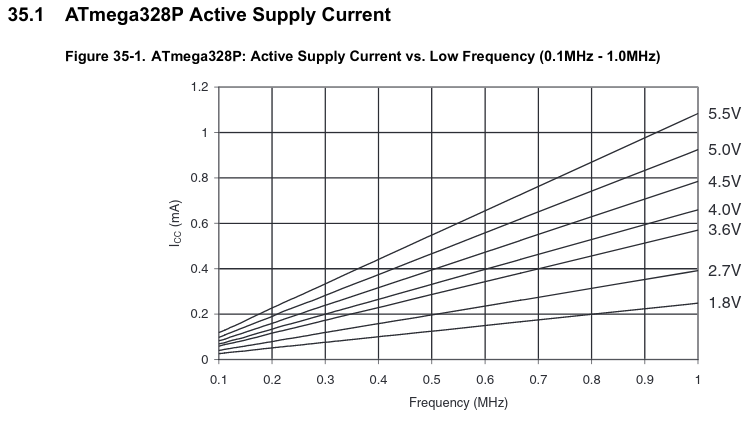<!-- style="width: 75%; max-width: 1000px" -->

<!-- style="width: 65%; max-width: 1000px" -->

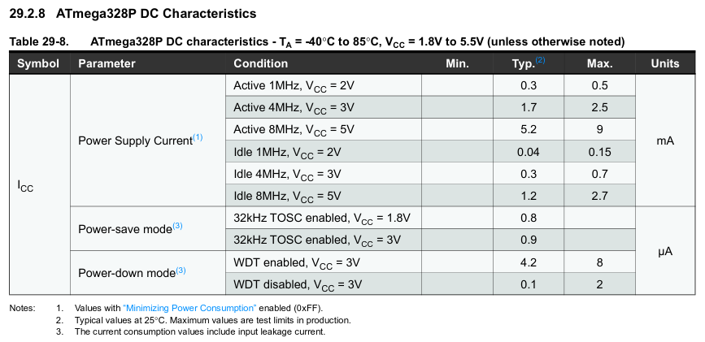<!-- style="width: 85%; max-width: 1000px" -->

> **Aufgabe:** Zeichen Sie ein Diagramm das die maximale Taktfrequenz über der anliegenden Betriebsspannung zeigt.

        {{1}}
************************************************************

Für jede Anwendung sollte geprüft werden, welche Komponenten des Controllers überhaupt gebraucht werden! Die Energieaufnahme lässt sich damit erheblich reduzieren.

In verschiedenen „Sleep“-Modi kann der Controllers im Hinblick auf:

- Aktive Clocks
- Oszillatoren
- Wake-Up Geräte

abgestimmt werden.

<!-- style="width: 85%; max-width: 1000px" -->

**Idle Mode** Die CPU stoppt die Abarbeitung, die Timer, UART, ADC arbeiten aber weiter. Der Controller kann damit zum Beispiel auf ein Ereignis abwarten ohne selbst Energie zu verbrauchen. Der Stromverbrauch sinkt auf ca. 0,04 mA, Aus diesem Modus kann jeder Interrupt die CPU wieder wecken.

**ADC Noise Reduction Mode** Dieser Mode schränkt die aktivien Module noch weiter ein, der Takt für die IO-Module abgeschaltet. Nur noch der AD-Wandler, die externen Interrupts, das TWI und der Watchdog sind funktionsfähig (wenn man sie nutzen will). Zielstellung ist die reduzierung potentieller Störungen für die Analog-Digital-Wandlung.

**Power Save Mode** Hier werden fast alle Oszillatoren gestoppt. Die einzige Ausnahme ist der Timer2, welcher asynchron betrieben werden kann. Der ausgewählte Hauptoszillator läuft aber weiter. Damit kann eine minimale Aufweckzeit für das Reaktivieren der CPU realisiert werden.

**Power Down Mode** Das ist der "tiefste" Schlafmodus. Es werden alle Module gestoppt, das Aufwecken ist allein über die asynchronen Timer möglich. Die Stromaufnahme wird nur noch von Leckströmen bestimmt und liegt bei abgeschaltetem Watchdog-Timer bei 100 nA.

************************************************************

[^megaAVR]: Firma Microchip, megaAVR® Data Sheet, [Link](http://ww1.microchip.com/downloads/en/DeviceDoc/ATmega48A-PA-88A-PA-168A-PA-328-P-DS-DS40002061A.pdf)

### Taktgenerator

<!-- style="width: 75%; max-width: 1000px" -->

!?[movie](https://www.youtube.com/watch?v=eYVOdlK15Og)<!--
style = "width: 720px; height: 420px;"
-->

+ Interne Oszillatoren (RC-osciallators)

  - Schwingkreis aus Widerstand und Kondensator
  - Maximale Frequenz 8 MHz
  - standardmäßig als Taktquelle vorkonfiguriert
  - Frequenzabweichung +/- (3-10) %

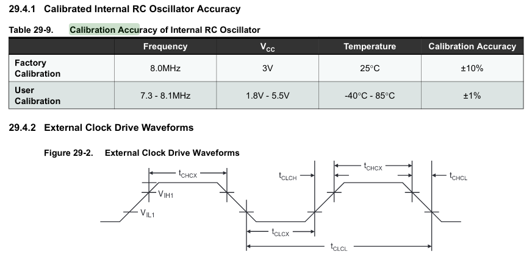<!-- style="width: 75%; max-width: 1000px" -->

+ Schwingquarze (crystal oscillators)

  - deutliche geringere Maximalabweichung +/- 0.1 %
  - Einschwingdauer deutlich höher (10.000 Taktzyklen)
  - mindestens 3 externe Bauteile (2 Lastkondensatoren + Quarz)

+ Externes Taktsignal


[^megaAVR]: Firma Microchip, megaAVR® Data Sheet, [Link](http://ww1.microchip.com/downloads/en/DeviceDoc/ATmega48A-PA-88A-PA-168A-PA-328-P-DS-DS40002061A.pdf)

### Speicher


Bei der Analyse der Struktur des AVRs haben wir bisher 3 Arten von Speicher kennengelernt:

<!-- data-type="none" -->
|                     | Flash           | EEPROM     | RAM              |
| ------------------- | --------------- | ---------- | ---------------- |
| Zweck               | Programmspeicher|            | Arbeitsspeicher  |
| Größe im Atmega328p | 32 KByte        | 1 KByte    | 2 KByte          |
| Schreibzyklen       | $>10.000$       | $>100.000$ | unbegrenzt       |
| Lesezyklen          | unbegrenzt      | unbegrenzt | unbegrenzt       |
| flüchtig            | nein            | nein       | ja               |


**Flash-ROM** des AVRs werden die Programme abgelegt. Über das Programmierinterface werden die kompilierten Programme vom PC an den Controller übertragen und hier gespeichert. Die Adressierung erfolgt über den Programmcounter. Bei der Programmausführung wird der Flash-Speicher Wort für Wort (16 Bit Breite) ausgelesen. Hier können neben den eigentlichen Programminformationen aber auch Daten abgelegt werden. Es kann beliebig oft ausgelesen werden, aber theoretisch nur ~10.000 mal beschrieben werden.

<!-- style="width: 75%; max-width: 1000px" -->

$$3FFF = 16383 Speicherstellen$$
$$ 16383 \cdot 2Byte = 32766 Byte = 32KB = 2^{15} Bit$$

Das **EEPROM** ist ein nichtflüchtiger Speicher, der aus dem Programm heraus beschrieben und gelesen werden kann. Es kann beliebig oft gelesen und mindestens 100.000 mal beschrieben werden. In Mikrocontrollern wird dieser Speicher für das Hinterlegen von Nutzerparametern, Kalibrierdaten usw. genutzt.

Das **RAM** ist ein flüchtiger Speicher, mit dem Ausschalten gehen die Daten verloren. Es kann beliebig oft gelesen und beschrieben werden, der Zugriff wird über den Stack-Pointer gelöst. Einige AVR ermöglichen die Erweiterung des SRAM durch nach außen geführte Adressleitungen

**General Purpose Register** R0-R31 sind flüchtige, 8 Bit breite temporäre Speicher, die Daten aufnehmen und als Ausgangspunkt für Operationen der ALU genutzt werden (Load-Store Architektur).

Die **I/O Register** dienen der Konfiguration des Controllers bzw. der Interaktion mit der Peripherie (Ergebnis einer Analog-Digital-Wandlung, Zähler Wert, eingehendes Byte auf der seriellen Schnittstelle).

> **Merke** Die unterschiedlichen Speicherformen (RAM, GP Register, I/O Register) werden entsprechend der Idee des _Mapped Memory IO_ über einheitliche Befehle adressiert.

<!-- style="width: 75%; max-width: 1000px" -->

| getrennter Adressraum                                      | gemeinsamer Adressraum                                                     |
| ---------------------------------------------------------- | -------------------------------------------------------------------------- |
| - klaren Trennung von Speicher- und Ein-/Ausgabezugriffen. | - homogene Befehle und Adressierungsarten |
| - der Speicheradressraum wird nicht durch Ein-/Ausgabe-Einheiten reduziert                                                           |                                                                            |
| - Ein-/Ausgabeadressen können schmaler gehalten werden als Speicheradressen                                                           |                                                                            |

Der EEPROM ist nicht Bestandteil des _Mapped Memory IO_ Konzepts! Vielmehr existiert für diesen ein eigener Zugriffsmechanismus, der über die zugehörigen IO-Register realsiert wird.

<!-- style="width: 75%; max-width: 1000px" -->

[^megaAVR]: Firma Microchip, megaAVR® Data Sheet, [Link](http://ww1.microchip.com/downloads/en/DeviceDoc/ATmega48A-PA-88A-PA-168A-PA-328-P-DS-DS40002061A.pdf)

### Reset-System

<!-- style="width: 75%; max-width: 1000px" -->

Quellen für Reset

+  Power-on Reset
+  External Reset
+  Watchdog Reset
+  Brown-out Reset
+  JTAG AVR Reset

**Was passiert beim Reset?**

+ Einschwingen des Oszilatoren
+ Initialisieren des Speichers
+ Konfiguration der Schlafmodi, Clocks entsprechend den FUSE-Bits
+ Prozessorstart  an der Adresse 0000. An dieser Adresse MUSS ein Sprungbefehl an die Adresse des Hauptprogrammes stehen (RJMP, JMP)
+ Initialisieren des Stacks
+ Beginn der Programmabarbeitung

[^megaAVR]: Firma Microchip, megaAVR® Data Sheet, [Link](http://ww1.microchip.com/downloads/en/DeviceDoc/ATmega48A-PA-88A-PA-168A-PA-328-P-DS-DS40002061A.pdf)

### Digitale Ein/Ausgaben

Für die letztendliche Inbetriebnahme fehlt uns noch ein Baustein, die Ansteuerung eines "externen Gerätes". Im Bereich der eingebetteten Systeme ist dies zumeist ein LED, die direkt an einen der Pins des Mikrocontrollers angeschlossen wird.

Schauen wir uns den grundsätzlichen Mechanismus noch mal an einem abstrahierten 8-Bit Eingang an:

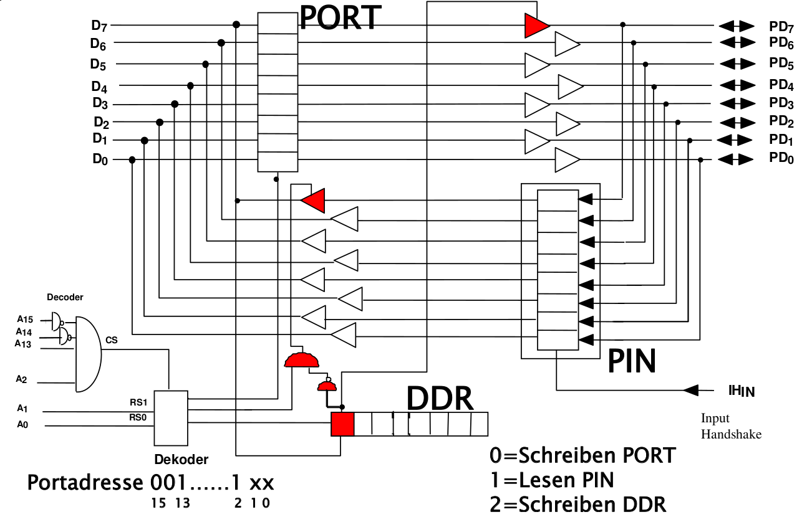<!-- style="width: 85%; max-width: 1000px" -->

Wie ist das Ganze konkret am AVR umgesetzt?


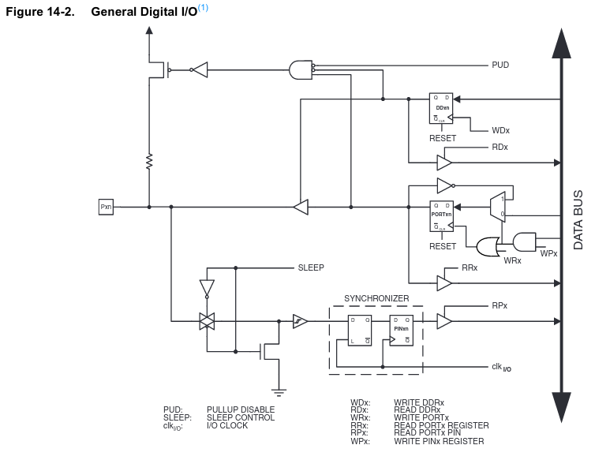<!-- style="width: 75%; max-width: 1000px" -->

| DDRx       | PORTx | Zustand des Pin            |
| ---------- | ----- | -------------------------- |
| 0 (input)  | 0     | Eingang ohne Pull-Up       |
| 0 (input)  | 1     | Eingang mit Pull-Up        |
| 1 (output) | 0     | Push-Pull Ausgang auf Low  |
| 1 (output) | 1     | Push-Pull Ausgang auf High |

https://www.youtube.com/watch?v=bDPdrWS-YUc&feature=emb_logo

Das Latch entkoppelt die Eingangsspannung und deren Erfassung, bewirkt aber eine Verzögerung. Im schlimmsten Fall beträgt diese 1.5 Clockzyklen im besten 1 Clockzyklus.

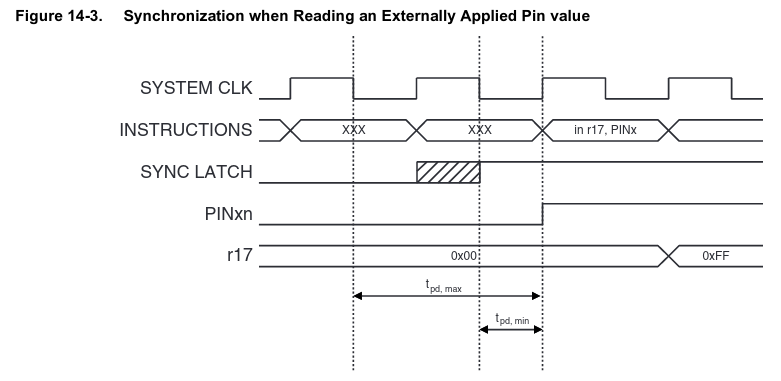<!-- style="width: 75%; max-width: 1000px" -->

[^megaAVR]: Firma Microchip, megaAVR® Data Sheet, [Link](http://ww1.microchip.com/downloads/en/DeviceDoc/ATmega48A-PA-88A-PA-168A-PA-328-P-DS-DS40002061A.pdf)

## Integration in Schaltung

Und wie setzen wir das Ganze in einer konkreten Schaltung um?

<!-- style="width: 85%; max-width: 1000px" -->

[^14]: Arduino Webseite [Link](https://content.arduino.cc/assets/UNO-TH_Rev3e_sch.pdf)

<!-- style="width: 55%; max-width: 1000px" -->

[^15]: Arduino Webseite [Link](https://store.arduino.cc/arduino-uno-rev3)

**Arduino Hardware/Software Cosmos**

Ziel: Einfache Entwicklung für Mikrocontroller für studentische (& professionelle) Projekten

+ Open-Hardware:

  + Hardwareentwurf und Software sind Open Source
  + Basismodule mit unterschiedlichen Controllern
  + „Shields“ zur Erweiterung der Funktionalität

+ Software

  + Entwicklungsumgebung auf der Basis von Processing
  + Bibliotheken für häufig genutzte Funktionen
  + Abstraktion der Programmstruktur `loop` und `setup`

> **Merke: ** Wir wollen kein "Arduino-Kurs" sein, vielmehr geht es darum, die Konzepte hinter der Arduino-Fassade zu verstehen.

Entsprechend können Sie in den Übungen die Tools der Arduino IDE nutzen, die Programmierung erfolgt aber allein mit der `avrlibc`.

## Programmierung des Hello-World Beispiels

```text @plantUML.png
@startuml
ditaa

+-----------------------------------------------------------------------------------------+
:  Entwicklungsrechner                                                                    |                  
|  +---------------+                                                                      |                
|  |c88FSimulink{o}|   Modellierungssprachen                                              |                                     
|  +---------------+                                                                      |                
|          |                                                                              |
|          v                                   Assemblerprogrammierung                    |
|  +---------------+     +---------------+     +---------------+                          |            
|  |c88F C/C++{o}  |---> |c8F8 avr-gcc   |---> |c88F *.asm{o}  |                          |            
|  +---------------+     +---------------+     +---------------+                          |           
|                                                      |                                  |
|   C/C++ Programmierung                               v                                  |
|                                              +---------------+                          |         
|                                              |c8F8 avr-as    |                          |         
|                                              +---------------+                          |         
|                                                      |                                  |
|                                                      v                                  |
|                                              +---------------+                          |         
|                                              |      *.o{o}   |                          |         
|                                              +---------------+                          |         
|                                                      |                                  |
|                                                      v                                  |
|             +---------------+                +---------------+      +---------------+   |                                
|             |c8F8 objcopy   |<-------+       |c8F8 avr-ld    | <----|    Library{o} |   |                                
|             +---------------+        |       +---------------+      +---------------+   |                                
|                      |               |               |                                  |
|         +------------+-----------+   +---------------+                                  |
|         |                        |                   |                                  |                
|         v                        v                   v                                  |
|  +---------------+       +---------------+   +---------------+                          |         
|  |      *.hex{o} |  ...  |    *.bin{o}   |   |    *.elf{o}   |                          |         
|  +---------------+       +---------------+   +---------------+                          |  
|         |                        |                   |                                  |
|         +------------------------+-------------------+                                  |
|                                  |                                                      |
|                                  v                                                      |
|                          +---------------+                                              |
|                          |c8F8 Programmer|                                              |
|                          +---------------+                                              |     
+-----------------------------------------------------------------------------------------+
                                   |
                                   +-------------------------+                                    
+----------------------------------|-------------------------|----------------------------+
:                                  v                         v                            |
: +---------------+        +---------------+         +---------------+                    |
| |c2F8 SRAM      |<------ |c2F8 Flash     |         |c2F8 EEPROM    |                    |
| +---------------+        +---------------+         +---------------+                    |    
| Mikrocontroller                                                                         |
+-----------------------------------------------------------------------------------------+
@enduml
```
### Assembler

```as
main:  ; ------- INIT -------------------
       ; set DDRB as output
       ; sbi 0x04, 7               ; set bit in I/O register
       sbi _SFR_IO_ADDR(DDRB),5    ; more general by using MACROS
       ; ------- Busy waiting 1 s -------
loop:  ldi  r18, 41
       ldi  r19, 150
       ldi  r20, 128
L1:    dec  r20       ; 128
       brne L1        ; 255  * (1 + 2)
       dec  r19       ;        150   
       brne L1        ;        255  * (1 + 2)
       dec  r18       ;                41 * (1 + 2)
       brne L1        ;
       ; next assembly does not work with tiny avr controlers!          
       sbi  _SFR_IO_ADDR(PINB),5
       rjmp loop
```

```
avr-gcc -mmcu=atmega328p -nostdlib as_code.S -o as_code.elf
```

Die Generierung der Warteschleife von 1s ist dem Delay-Generator http://darcy.rsgc.on.ca/ACES/TEI4M/AVRdelay.html entnommen.

### C++ / C

<div>
  <wokwi-led color="red" pin="13" port="B" label="13"></wokwi-led>
  <span id="simulation-time"></span>
</div>
```cpp       avrlibc.cpp
// preprocessor definition
#define F_CPU 16000000UL

#include <avr/io.h>
#include <util/delay.h>

int main (void) {
   DDRB |= (1 << PB5);
   while(1) {
       // PINB = (1 << PB5);   // Dieses Feature ist im Simulator nicht
                               // implementiert
       PORTB ^= ( 1 << PB5 );
       _delay_ms(1000);
   }
   return 0;
}
```
@AVR8js.sketch


<div>
  <wokwi-led color="red" pin="13" port="B" label="13"></wokwi-led>
  <span id="simulation-time"></span>
</div>
```cpp       arduino.cpp
// the setup function runs once
void setup() {
  // initialize digital pin 13 as an output.
  pinMode(13, OUTPUT);
}

void loop() {
  digitalWrite(13, HIGH);
  delay(1000);
  digitalWrite(13, LOW);
  delay(1000);              
}
```
@AVR8js.sketch

### Simulink


<!-- style="width: 85%; max-width: 1000px" -->[^16]

[^16]: Mathworks Simulink, Simulink Support Package for Arduino Hardware, [Link](https://de.mathworks.com/help/supportpkg/arduino/examples/getting-started-with-arduino-hardware.html#d122e134)


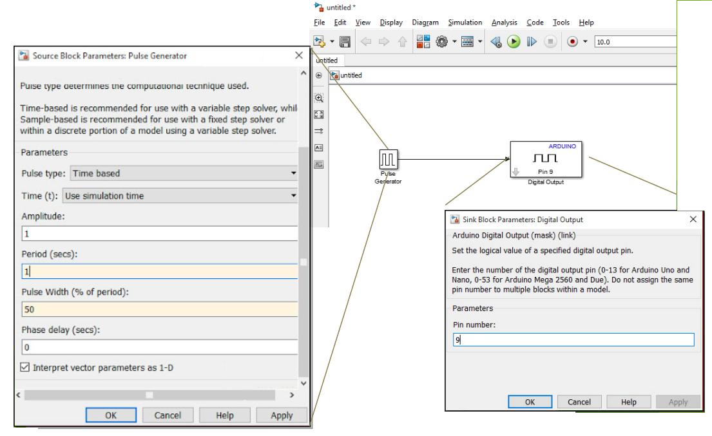<!-- style="width: 85%; max-width: 1000px" -->

### Vergleich

| Aspekte                   | Simulink                                    | Arduino                | avrlibc                                 | Assembler                               |     |
| ------------------------- | ------------------------------------------- | ---------------------- | --------------------------------------- | --------------------------------------- | --- |
| Code Größe                | 3232 Byte                                   | 928 Byte               | 30 Byte                                 | 24 Byte                                 |     |
|                           |                                             |                        | (162 Byte)                              |                                         |     |
| Bemerkung                 | Kompletter Scheduler, erweiterte Interfaces | Hardware Timer, printf | Statische Loop für blockierendes Warten | Statische Loop für blockierendes Warten |     |
| Übertragbarkeit des Codes | einige Arduino Boards                       | Alle Arduino Boards    | Gesamte ATmega Familie                  | Einige Controller der Atmega Familie    |     |
| Taktrate                  | explizit                                    | implizit               | explizit                                | implizit                                |     |
| Expertenwissen            | gering                                      | mittel                 | hoch                                    | sehr hoch                               |     |

Was wir nicht betrachtet haben ...

+ Konfigurationen der verschiedenen Toolchains
+ Optimierungsstufen des Compilers
+ Einbettung weiterer Hardwarefunktionalität (Timerbausteine)

Welche Abgrenzung ist zudem möglich?

<!--
style="width: 80%; min-width: 420px; max-width: 720px;"
-->
```ascii


  Hardware-   <-------------------------------------------->     Abstraktion
  nähe                                                                         .
                |            |        |                  |
            Assembler     avrlibc  Arduino            Simulink
```


### Resultat

Wie sieht unser ausführbarer Code am Ende aus? Betrachten wir das Ergebnis der
Kompilierung unseres C Beispiels.

<!--
style="width: 80%; min-width: 420px; max-width: 720px;"
-->
```ascii
 Byte Count
 |     Type (00 = Data, 01 = EOF, 02 ...)
 |     |                                 Checksumme
"--"  "--"                              "--"
:100000000C9472000C947E000C947E000C947E0084
:100010000C947E000C947E000C947E000C947E0068
:100020000C947E000C947E000C947E000C947E0058
…
:1000A0000C947E000C947E000C947E000C947E00D8
:1000B0000C947E000C947E000C947E000C947E00C8
:1000C0000C947E000C947E000C947E000C947E00B8
:1000D0000C947E000C947E000C947E000C947E00A8
:1000E0000C947E0011241FBECFEFD1E2DEBFCDBF46
:1000F00000E00CBF0E9480000C9483000C94000070
:0A010000279A2F98FFCFF894FFCF            45
:00000001FF
  "---" "--------------------------------"
    |                  |
    |          Daten (hier 16 Byte)
    Adresse                                                                    .
```

Wie können wir die Inhalte interpretieren?

Die erste Zeile wird im Speicher wie folgt dargestellt:

| Adresse | Inhalt |
| ------- | ------ |
| 0x0000  | 0C     |
| 0x0001  | 94     |
| 0x0002  | 72     |
| 0x0003  | 00     |
| 0x0004  | 0C     |
| 0x0005  | 94     |
| 0x0006  | 7E     |
| 0x0007  | 00     |

Die 16 Bit breiten Befehle sind im Little Endian Muster im Speicher abgelegt.

> **Aufgabe:** Recherchieren Sie die Unterschiede zwischen Big Endian und Little Endian Darstellungen.

Das erste Befehlswort entspricht somit  $94 0c$ = $1001.0100.0000.1100$. Wir übernehmen nun die Rolle des Instruktion-Dekoders und durchlaufen alle Befehle,
die im Befehlssatz vorhanden sind.

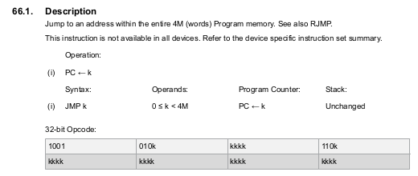<!-- style="width: 85%; max-width: 1000px" -->[^17]

[^17]: Firma Microchip, Atmel AVR Instruction Set Manual, Seite 103

Offenbar handelt es sich um einen `Jump` Befehl. Dieser besteht aus 2 Worten, wir müssen also ein weiteres mal auf dem Speicher zugreifen. Im Anschluss steht die Binärrepräsentation unseres Befehls komplett bereit. Die `-` markieren jeweils die Opcode-Bits.

```
        ---- ---       ---
94 0c = 1001.0100.0000.1100
00 72 = 0000.0000.0111.0010

Folgeadresse 00.0000.0000.0000.0111.0010 = 0x72
```

Nun greift aber eine Besonderheit des AVR Controllers. Dieser adressiert seine Speicherinhalte Wortweise. Der GCC erzeugt aber byteweise adressierten Code. Im Objektfile finden sie die byteweisen Adressierungen in der ersten Spalte. Um also die wortbasierten Adressen "umzurechnen" müssen Sie mit 2 multipliziert werden. In unserem Fall folgt daraus `0xe4`.

```asm
00000000 <__vectors>:
   0:	0c 94 72 00 	jmp	0xe4	; 0xe4 <__ctors_end>
   4:	0c 94 7e 00 	jmp	0xfc	; 0xfc <__bad_interrupt>
   8:	0c 94 7e 00 	jmp	0xfc	; 0xfc <__bad_interrupt>
   c:	0c 94 7e 00 	jmp	0xfc	; 0xfc <__bad_interrupt>
   ...

000000e4 <__ctors_end>:
  e4:	11 24       	eor	r1, r1
  e6:	1f be       	out	0x3f, r1	; 63
  ...

000000fc <__bad_interrupt>:
  fc:	0c 94 00 00 	jmp	0	; 0x0 <__vectors>

```

Im Programmspeicher steht auf den ersten 8 Byte `jmp 0xe4`

## Vorbereitung der praktischen Aufgaben

**Bitoperationen in C**

| Operation | Bedeutung               |
| --------- | ----------------------- |
| `>>`      | Rechts schieben         |
| `<<`      | Links schieben          |
| `|`       | binäres, bitweises ODER |
| `&`       | binäres, bitweises UND  |
| `^`       | binäres, bitweises XOR  |

```cpp                     Bitshifting.cpp
#include <iostream>
#include <bitset>

int main()
{
  char v = 0x1;
  for (int i = 0; i <=7; i++){
    std::cout << std::bitset<8>((v<<i)) << std::endl;
  }
  return 0;
}
```
@LIA.eval(`["main.c"]`, `g++ -Wall main.c -o a.out`, `./a.out`)

Mit diesen Operationen werden sogenannte Masken gebildet und diese dann auf die
Register übertragen.

### Setzen eines Bits

```cpp                     BitSetting.cpp
#include <iostream>
#include <bitset>

/* übersichtlicher mittels Bit-Definitionen */
#define PB0 0
#define PB1 1
#define PB2 2

int main()
{
  char PORTB;  // Wir "simulieren" die Portbezeichnung
  PORTB = 0;
  std::cout << std::bitset<8>(PORTB) << std::endl;

  // Langschreibweise
  PORTB = PORTB | 1;
  std::cout << std::bitset<8>(PORTB) << std::endl;
  // Kurzschreibweise
  PORTB |= 0xF0;   
  std::cout << std::bitset<8>(PORTB) << std::endl;

  // Kurzschreibweise mit mehrteiliger Maske (setzt Bit 0 und 2 in PORTB auf "1")
  PORTB |= ((1 << PB0) | (1 << PB2));
  std::cout << std::bitset<8>(PORTB) << std::endl;
}
```
@LIA.eval(`["main.c"]`, `g++ -Wall main.c -o a.out`, `./a.out`)

### Löschen eines Bits

Das Löschen basiert auf der Idee, dass wir eine Maske auf der Basis der invertierten
Bits generieren und diese dann mit dem bestehenden Set mittels `&` abbilden.

```cpp                     BitSetting.cpp
#include <iostream>
#include <bitset>

/* übersichtlicher mittels Bit-Definitionen */
#define PB0 0
#define PB1 1
#define PB2 2

int main()
{
  char PORTB = ((1 << PB0) | (1 << PB2));
  std::cout << std::bitset<8>(PORTB) << std::endl;

  PORTB &= ~(1 << PB0);
  std::cout << std::bitset<8>(PORTB) << std::endl;
}
```
@LIA.eval(`["main.c"]`, `g++ -Wall main.c -o a.out`, `./a.out`)

### Prüfen eines Bits

```cpp                     BitSetting.cpp
#include <iostream>
#include <bitset>

/* übersichtlicher mittels Bit-Definitionen */
#define PB0 0
#define PB1 1
#define PB2 2

int main()
{
  char PORTB = ((1 << PB0) | (1 << PB2));
  std::cout << std::bitset<8>(PORTB) << std::endl;

  if (PORTB & (1 << PB0))
       std::cout << "Bit 2 gesetzt" << std::endl;
  if (!(PORTB & (1 << PB0)))
       std::cout << "Bit 2 nicht gesetzt" << std::endl;
  // Ist PB0 ODER PB2 gesetzt?
  if (PORTB & ((1 << PB0) | (1 << PB2)))
     std::cout << "Bit 0 oder 2 gesetzt" << std::endl;
}
```
@LIA.eval(`["main.c"]`, `g++ -Wall main.c -o a.out`, `./a.out`)
